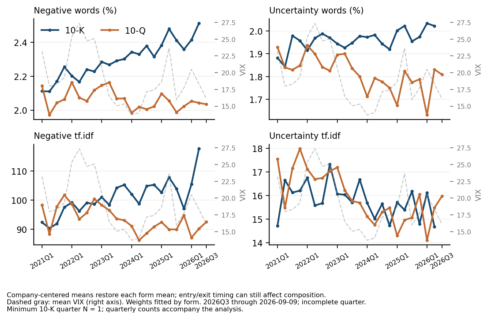

# Uncertainty and sentiment in financial reports

FRE-GY 7871 A · NLP and the Investment Process · Filing dates 2021-01-01 to 2026-09-09

[Research repository](https://github.com/robynge/FRE-GY-7871A-Assignment1)

1,935 filings from 97 companies enter the text analysis. The volatility analysis uses 1,600 filings and the return analysis uses 1,682. Negative words measure adverse language; uncertainty words measure imprecision and hedging. All results describe associations in companies selected from ARK holdings.

Within companies, annual-report negative-word shares change by +0.062 percentage points per year (p < 0.001); quarterly-report uncertainty changes by -0.015 points (p = 0.126). After controlling for prior volatility, 1 of 6 uncertainty specifications are significant at 5%. The pooled negative-tone return estimate is not significant at 5% (p = 0.352).

Filing coverage ends on 2026-09-09; market observations end on 2026-09-08. Recent filings remain in text analysis even when their future price windows are unavailable. Return and volatility samples are filtered separately; both volatility specifications use the same observations. The latest included filings are 2026-09-02 for returns and 2026-06-05 for volatility.

The final calendar quarter is incomplete as of 2026-09-09. Its filing counts, tone averages and VIX average are partial-quarter observations; they should not be compared with completed quarters as if coverage were equal.

## Table 1. Sample construction

Panel A counts holding identifiers, then companies. The frozen six-fund holdings use January 2, 2026 for ARKF and ARKX and September 4, 2026 for the other four funds. Different share classes are combined by SEC company identifier. The holdings dates define a retrospective company universe.

| Company/security filter              | Removed   | Remaining   | Unit        |
|:-------------------------------------|:----------|:------------|:------------|
| Raw holding identifiers              | 0         | 130         | identifiers |
| Funds and non-company securities     | 4         | 126         | identifiers |
| Foreign local listings               | 8         | 118         | identifiers |
| Unresolved SEC identifiers           | 3         | 115         | identifiers |
| Combine share classes by company CIK | 1         | 114         | companies   |
| 20-F / 40-F reporting companies      | 17        | 97          | companies   |

Panel B — Text sample. Counts follow this panel’s filter order.

| Filing filter                        | Removed   | Remaining   | Companies   |
|:-------------------------------------|:----------|:------------|:------------|
| All 10-K/Q and amendments            | 0         | 2,001       | 97          |
| Remove amendments and parse failures | 58        | 1,943       | 97          |
| Minimum words: 2,000 K / 1,000 Q     | 0         | 1,943       | 97          |
| Earliest company filing each quarter | 8         | 1,935       | 97          |

Panel B — Volatility sample. Counts follow this panel’s filter order.

| Filing filter                            | Removed   | Remaining   | Companies   |
|:-----------------------------------------|:----------|:------------|:------------|
| Eligible text filings                    | 0         | 1,935       | 97          |
| Usable day 0 and prior price at least $3 | 117       | 1,818       | 97          |
| Outcome window elapsed by market cutoff  | 94        | 1,724       | 94          |
| 60 observed returns before and after     | 26        | 1,698       | 91          |
| Complete pre/post volatility windows     | 0         | 1,698       | 91          |
| Accession-matched outstanding shares     | 81        | 1,617       | 87          |
| Complete liquidity and model controls    | 17        | 1,600       | 87          |

Panel B — Return sample. Counts follow this panel’s filter order.

| Filing filter                            | Removed   | Remaining   | Companies   |
|:-----------------------------------------|:----------|:------------|:------------|
| Eligible text filings                    | 0         | 1,935       | 97          |
| Usable day 0 and prior price at least $3 | 117       | 1,818       | 97          |
| Outcome window elapsed by market cutoff  | 3         | 1,815       | 96          |
| 60 observed returns before filing        | 28        | 1,787       | 95          |
| Complete four-session return window      | 0         | 1,787       | 95          |
| Accession-matched outstanding shares     | 88        | 1,699       | 91          |
| Complete liquidity and model controls    | 17        | 1,682       | 91          |

58 amendments and 0 parse failures are recorded. All 1,943 successfully parsed original filings receive tone scores before analytical sample restrictions. Market-data restrictions do not determine the text sample.

## Table 2. Tone by report type

The text sample determines descriptive statistics and trends. Proportional scores are percentages; weighted scores are equation (1) sums. Document frequencies are fitted within each analytical sample and separately by report type.

| Form   | Measure               | N     | Mean    | SD     | P25    | Median   | P75     |
|:-------|:----------------------|:------|:--------|:-------|:-------|:---------|:--------|
| 10-K   | Negative words (%)    | 489   | 2.298   | 0.420  | 2.013  | 2.310    | 2.581   |
| 10-K   | Uncertainty words (%) | 489   | 1.963   | 0.242  | 1.821  | 1.979    | 2.132   |
| 10-K   | Negative tf.idf       | 489   | 100.784 | 36.898 | 71.619 | 93.659   | 128.697 |
| 10-K   | Uncertainty tf.idf    | 489   | 15.868  | 5.666  | 11.958 | 15.010   | 18.943  |
| 10-Q   | Negative words (%)    | 1,446 | 2.049   | 0.972  | 1.177  | 1.809    | 2.983   |
| 10-Q   | Uncertainty words (%) | 1,446 | 1.820   | 0.587  | 1.321  | 1.652    | 2.415   |
| 10-Q   | Negative tf.idf       | 1,446 | 93.057  | 79.238 | 26.665 | 59.411   | 156.314 |
| 10-Q   | Uncertainty tf.idf    | 1,446 | 15.951  | 8.621  | 8.952  | 13.989   | 22.347  |

Negative/uncertainty correlations (proportional, weighted): All: 0.849, 0.917; 10-K: 0.720, 0.823; 10-Q: 0.854, 0.923.

## Table 3. Most frequent dictionary words

Each percentage divides a word count by all token occurrences in its dictionary category across the text sample.

| Rank   | Negative word   | Share %   | Uncertainty word   | Share %    |
|:-------|:----------------|:----------|:-------------------|:-----------|
| 1      | LOSS            | 5.170     | MAY                | 35.615     |
| 2      | ADVERSELY       | 4.200     | COULD              | 18.414     |
| 3      | LOSSES          | 3.105     | RISK               | 4.972      |
| 4      | CLAIMS          | 3.086     | RISKS              | 4.541      |
| 5      | ADVERSE         | 2.814     | BELIEVE            | 2.885      |
| 6      | AGAINST         | 2.467     | APPROXIMATELY      | 2.505      |
| 7      | UNABLE          | 2.020     | ASSUMPTIONS        | 1.874      |
| 8      | LITIGATION      | 1.994     | INTANGIBLE         | 1.600      |
| 9      | HARM            | 1.903     | POSSIBLE           | 1.302      |
| 10     | FAILURE         | 1.845     | UNCERTAINTIES      | 1.151      |
| 11     | FAIL            | 1.364     | FLUCTUATIONS       | 1.103      |
| 12     | IMPAIRMENT      | 1.216     | MIGHT              | 1.068      |
| 13     | NEGATIVELY      | 1.171     | UNCERTAIN          | 1.010      |
| 14     | DIFFICULT       | 1.169     | ANTICIPATED        | 0.983      |
| 15     | PENALTIES       | 1.161     | VOLATILITY         | 0.937      |
| 16     | NEGATIVE        | 1.042     | PREDICT            | 0.931      |
| 17     | DELAYS          | 0.964     | DEPEND             | 0.922      |
| 18     | DAMAGES         | 0.931     | UNCERTAINTY        | 0.898      |
| 19     | RESTATED        | 0.921     | DIFFER             | 0.853      |
| 20     | DECLINE         | 0.911     | ANTICIPATE         | 0.794      |
| 21     | LIMITATIONS     | 0.867     | CONTINGENT         | 0.777      |
| 22     | DELAY           | 0.866     | EXPOSURE           | 0.760      |
| 23     | VOLATILITY      | 0.788     | DEPENDS            | 0.674      |
| 24     | CHALLENGES      | 0.776     | VARIABLE           | 0.663      |
| 25     | FINES           | 0.728     | PENDING            | 0.646      |
| 26     | DISRUPTIONS     | 0.702     | DEPENDENT          | 0.575      |
| 27     | HARMED          | 0.689     | CONTINGENCIES      | 0.549      |
| 28     | INVESTIGATIONS  | 0.680     | PROBABLE           | 0.506      |
| 29     | BREACH          | 0.666     | ASSUMED            | 0.488      |
| 30     | INFRINGEMENT    | 0.623     | VARY               | 0.475      |

The top ten words account for 28.6% of negative tokens and 74.9% of uncertainty tokens. The active dictionaries contain 2,345 negative and 297 uncertainty words, with 40 words in both categories.

## Tone measures

The Loughran–McDonald Master Dictionary, 1993–2025 release, was updated in March 2026. A positive category value identifies an active word; a negative value records removal from that category. Only active entries enter the scores. Thus the negative category contains 2,345 words; the 10 removed entries are excluded. The proportional score divides category occurrences by all tokens in a filing.

$$
P_{cj}=\frac{\sum_{i\in c}tf_{ij}}{W_j}
$$

Equation (1) applies logarithmic term frequency and inverse document frequency. The score sums weights over category words observed in a filing.

$$
\begin{aligned}
T_{cj}=\sum_{i\in c,\,tf_{ij}>0}\frac{1+\ln(tf_{ij})}{1+\ln(a_j)}\ln\!\left(\frac{N}{df_i}\right)\\
a_j=\frac{W_j}{V_j}
\end{aligned}
$$

W is total tokens, V is distinct tokens, N is documents in the relevant estimation corpus and df is document frequency. All logarithms are natural. The text, volatility and return samples each fit their own word weights; report-type analyses also refit within form. The weighted score is measured in score units rather than percentages.

An illustrative calculation uses “LOSS LOSS RISK GAIN”, “LOSS GAIN GAIN” and “RISK RISK RISK GAIN”, with category {LOSS, RISK}. Their weighted scores are 0.8480, 0.2885 and 0.5026. These constructed documents illustrate the formula.

Primary-document text retains visible XBRL facts and excludes hidden content, separate exhibits and tables with more than 15% digits among non-space characters. Alphabetic tokens contain at least two characters and retain apostrophes and hyphens. Incorporated-by-reference text is not recovered.

TSLA's 10-Q filed 2023-10-23 contains 2.72% negative words and 1.05% uncertainty words, at percentile ranks 71 and 4, respectively. It has the largest negative-minus-uncertainty percentile gap in the text sample. This selected contrast is not representative of all filings.

Selected filing language: On October 27, 2021, the Court approved the parties’ joint stipulation that, among other things, (a) all claims against Kimbal Musk and Steve Jurvetson …

Dictionary counts identify category vocabulary; they do not determine the direction or significance of the event described.

MAY and COULD account for 54.0% of uncertainty tokens. These counts do not distinguish recurring disclosure language from newly expressed uncertainty. High negative/uncertainty correlations also mean the two measures do not provide independent evidence.

MAY occurs in 100.0% of filings and APPROXIMATELY in 98.8%. Inverse document frequency gives less weight to words appearing in most documents.

## Figure 1. Quarterly tone and VIX

10-K: 1–82 filings per observed quarter; 10-Q: 7–94 filings per observed quarter. Sparse annual-report quarters may reflect only a few companies. Company-centered means reduce baseline composition differences, but entry and exit periods can still affect this unbalanced panel. The gray dashed series is quarterly average VIX on the right axes; the latest quarter is partial when indicated. Formal trend inference uses Table 4.

## Table 4. Annual tone trends

Quarter-level means estimate the aggregate trend. Filing-level models estimate change within companies:

$$
\begin{aligned}
\bar T_q=\alpha+\beta\tau_q+\sum_{s=2}^{4}\delta_sD_{sq}+\varepsilon_q\\
T_{iq}=\alpha_i+\beta\tau_q+\sum_{s=2}^{4}\delta_sD_{sq}+\theta K_{iq}+\varepsilon_{iq}
\end{aligned}
$$

Time is elapsed years from the first sample quarter. Seasonal indicators control the reporting quarter of the year. Company effects control company mean levels; K indicates a 10-K in the pooled sample and is omitted within each report type. Saturated calendar-quarter effects are excluded because they would absorb the trend. Aggregate inference shows ordinary OLS and Newey–West t-statistics with four lags. Within-company t and p use two-way company/calendar-quarter clustering.

| Sample   | Measure     | Agg. slope   | OLS t   | NW t   | Within slope   | Within t   | p                    |
|:---------|:------------|:-------------|:--------|:-------|:---------------|:-----------|:---------------------|
| All      | Neg. %      | 0.021        | 2.790   | 2.334  | 0.010          | 0.856      | 0.401                |
| All      | Unc. %      | 0.003        | 0.689   | 0.595  | -0.004         | -0.515     | 0.612                |
| All      | Neg. tf.idf | 1.551        | 2.528   | 1.998  | 0.305          | 0.355      | 0.726                |
| All      | Unc. tf.idf | -0.053       | -0.473  | -0.329 | -0.186         | -1.417     | 0.171                |
| 10-K     | Neg. %      | 0.061        | 9.919   | 11.355 | 0.062          | 6.984      | $6.75\times 10^{-7}$ |
| 10-K     | Unc. %      | 0.019        | 3.540   | 3.351  | 0.029          | 7.523      | $2.17\times 10^{-7}$ |
| 10-K     | Neg. tf.idf | 3.266        | 3.169   | 3.431  | 2.205          | 3.402      | 0.003                |
| 10-K     | Unc. tf.idf | -0.145       | -0.912  | -1.155 | 0.043          | 0.230      | 0.820                |
| 10-Q     | Neg. %      | -0.013       | -1.198  | -1.391 | -0.007         | -0.492     | 0.628                |
| 10-Q     | Unc. %      | -0.030       | -2.819  | -3.366 | -0.015         | -1.591     | 0.126                |
| 10-Q     | Neg. tf.idf | -0.928       | -1.234  | -1.167 | -1.282         | -1.055     | 0.303                |
| 10-Q     | Unc. tf.idf | -0.391       | -3.046  | -2.695 | -0.348         | -2.192     | 0.039                |

Proportional slopes are percentage points per year; weighted slopes are score units per year. All: 97 companies, 23 quarters, 22 inference degrees of freedom; 10-K: 91 companies, 22 quarters, 21 inference degrees of freedom; 10-Q: 97 companies, 23 quarters, 22 inference degrees of freedom.

10-K negative-word shares change by +0.062 percentage points per year (p < 0.001); uncertainty-word shares change by +0.029 points (p < 0.001). The corresponding weighted slopes are +2.205 (p = 0.003) and +0.043 (p = 0.820).

10-Q negative-word shares change by -0.007 percentage points per year (p = 0.628); uncertainty-word shares change by -0.015 points (p = 0.126). The corresponding weighted slopes are -1.282 (p = 0.303) and -0.348 (p = 0.039).

Within-company estimates receive more weight than aggregate slopes because they account for company levels and reporting season. Proportional and weighted measures capture related language and are not independent replications. Sparse annual-report quarters limit interpretation of individual points in the chart. The final quarter also has incomplete filing coverage.

## Filing-event design

Day 0 is the first NYSE session on or after the later of the filing date and the Eastern acceptance date. Acceptance at or after the exchange’s actual close, including an early close, moves the event to the next session. Market data include only completed sessions through 2026-09-08.

$$
\begin{aligned}
R^{[0,3],\mathrm{excess}}=\frac{P^{\mathrm{adj}}_{+3}}{P^{\mathrm{adj}}_{-1}}-\frac{SPY^{\mathrm{adj}}_{+3}}{SPY^{\mathrm{adj}}_{-1}}\\
\sigma^{\mathrm{pre}}=\sqrt{252}\,\mathrm{SD}(r_{-60},\ldots,r_{-6})\\
\sigma^{\mathrm{post}}=\sqrt{252}\,\mathrm{SD}(r_{+4},\ldots,r_{+63})
\end{aligned}
$$

The event spans four daily return intervals. Pre-filing volatility uses 55 daily returns and post-filing volatility uses 60, with sample standard deviations. Adjusted closes measure returns; nominal closes determine the \$3 price filter and company size. Later splits are reversed for nominal price and volume histories. Future returns are not imputed.

Size is the day −1 nominal price times outstanding shares from the scored filing’s cover page. Same-date share classes are summed using one class price as a proxy; future or weighted-average shares are excluded. Liquidity is mean nominal dollar volume over days [−60,−6], and prior excess return is SPY-adjusted buy-and-hold return over that interval.

The outcome models use firm effects, calendar-quarter effects and the following controls:

$$
\begin{aligned}
C_{iq}=\gamma_1\ln(\mathrm{Size}_{iq})+\gamma_2\ln(\mathrm{DollarVolume}_{iq})\\
\qquad+\gamma_3R^{\mathrm{pre,excess}}_{iq}+\theta K_{iq}\\
\sigma^{\mathrm{post}}_{iq}=\alpha_i+\lambda_q+\beta U_{iq}+C_{iq}+[\rho\sigma^{\mathrm{pre}}_{iq}]+\varepsilon_{iq}\\
R^{[0,3],\mathrm{excess}}_{iq}=\alpha_i+\lambda_q+\beta N_{iq}+C_{iq}+\rho\sigma^{\mathrm{pre}}_{iq}+\varepsilon_{iq}
\end{aligned}
$$

U is uncertainty and N is negative tone, each estimated separately as a proportion and a weighted score. The bracketed pre-volatility term is included or omitted in the paired volatility tests; it is always included in the return tests. The 10-K indicator K applies only to the pooled sample. No winsorisation is applied.

## Table 5. Uncertainty and subsequent volatility

Dependent variable: annualised volatility as a fraction. Coefficients are per unit of uncertainty fraction or weighted score. Both specifications use the same complete observations within each sample. Two-way company/quarter clustering determines t and p. All: 87 companies, 22 quarters, 21 inference degrees of freedom; 10-K: 86 companies, 21 quarters, 20 inference degrees of freedom; 10-Q: 86 companies, 22 quarters, 21 inference degrees of freedom.

| Sample   | Measure   | Pre-vol   | Coefficient           | t      | p     | N     |
|:---------|:----------|:----------|:----------------------|:-------|:------|:------|
| All      | prop      | No        | 0.463                 | 0.360  | 0.722 | 1,600 |
| All      | prop      | Yes       | -0.096                | -0.091 | 0.929 | 1,600 |
| All      | tfidf     | No        | $-2.38\times 10^{-5}$ | -0.021 | 0.983 | 1,600 |
| All      | tfidf     | Yes       | $-3.15\times 10^{-4}$ | -0.327 | 0.747 | 1,600 |
| 10-K     | prop      | No        | -19.326               | -1.206 | 0.242 | 423   |
| 10-K     | prop      | Yes       | -26.211               | -1.457 | 0.161 | 423   |
| 10-K     | tfidf     | No        | -0.003                | -0.447 | 0.659 | 423   |
| 10-K     | tfidf     | Yes       | -0.002                | -0.267 | 0.792 | 423   |
| 10-Q     | prop      | No        | 4.734                 | 2.037  | 0.054 | 1,177 |
| 10-Q     | prop      | Yes       | 3.592                 | 1.689  | 0.106 | 1,177 |
| 10-Q     | tfidf     | No        | 0.004                 | 2.703  | 0.013 | 1,177 |
| 10-Q     | tfidf     | Yes       | 0.003                 | 2.204  | 0.039 | 1,177 |

Proportional uncertainty: a one-standard-deviation increase corresponds to -0.05 percentage points of annualised volatility after controlling for prior volatility (95% interval [-1.19, +1.09]). The uncontrolled effect is +0.24 points (p = 0.722), compared with p = 0.929 after control. Adding the control changes the estimated effect by -0.29 points. This comparison tests incremental association beyond existing volatility.

Weighted uncertainty: a one-standard-deviation increase corresponds to -0.30 percentage points of annualised volatility after controlling for prior volatility (95% interval [-2.22, +1.61]). The uncontrolled effect is -0.02 points (p = 0.983), compared with p = 0.747 after control. Adding the control changes the estimated effect by -0.28 points. This comparison tests incremental association beyond existing volatility.

For 10-Q weighted uncertainty, the effect per tone standard deviation changes from +3.02 to +2.35 volatility percentage points after adding prior volatility (p = 0.013 and = 0.039). The controlled proportional-score estimate has p = 0.106. Differences across weighting schemes and multiple unadjusted tests limit the strength of an isolated significant association.

## Table 6. Negative sentiment and filing-period excess return

Dependent variable: SPY-adjusted four-session buy-and-hold return as a fraction. All models include log size, log dollar volume, prior excess return, pre-filing volatility, company effects and calendar-quarter effects; pooled models also include the 10-K indicator. Coefficients are per unit of negative-word fraction or weighted score. t and p use two-way company/quarter clustering. All: 91 companies, 23 quarters, 22 inference degrees of freedom; 10-K: 86 companies, 22 quarters, 21 inference degrees of freedom; 10-Q: 90 companies, 23 quarters, 22 inference degrees of freedom.

| Sample   | Measure   | Coef.                 | t      | p     | Effect pp   | MDE pp   | N     |
|:---------|:----------|:----------------------|:-------|:------|:------------|:---------|:------|
| All      | prop      | -0.577                | -0.950 | 0.352 | -0.497      | 1.524    | 1,682 |
| All      | tfidf     | $-9.91\times 10^{-5}$ | -1.123 | 0.274 | -0.732      | 1.900    | 1,682 |
| 10-K     | prop      | -3.712                | -0.506 | 0.618 | -1.518      | 8.766    | 424   |
| 10-K     | tfidf     | $-8.31\times 10^{-4}$ | -1.445 | 0.163 | -3.166      | 6.401    | 424   |
| 10-Q     | prop      | -1.586                | -1.385 | 0.180 | -1.523      | 3.205    | 1,258 |
| 10-Q     | tfidf     | $-1.85\times 10^{-4}$ | -1.235 | 0.230 | -1.438      | 3.394    | 1,258 |

$$
\mathrm{MDE}^{\mathrm{pp}}_{80,1\mathrm{SD}}=100\left(t_{0.975,\nu}+\Phi^{-1}(0.8)\right)\mathrm{SE}(\hat\beta)\,s_{\mathrm{tone}}
$$

Effect and minimum detectable effect (MDE) are return percentage points per one tone standard deviation. MDE approximates 80% power for a two-sided 5% test using the stated inference degrees of freedom. It measures precision rather than observed power.

All: a one-standard-deviation increase in proportional negative tone corresponds to -0.50 return percentage points (p = 0.352), with an approximate detectable effect of 1.52 points. The weighted-score effect is -0.73 points (p = 0.274).

10-K: a one-standard-deviation increase in proportional negative tone corresponds to -1.52 return percentage points (p = 0.618), with an approximate detectable effect of 8.77 points. The weighted-score effect is -3.17 points (p = 0.163).

10-Q: a one-standard-deviation increase in proportional negative tone corresponds to -1.52 return percentage points (p = 0.180), with an approximate detectable effect of 3.20 points. The weighted-score effect is -1.44 points (p = 0.230).

Statistical insignificance does not establish zero price response. Earnings releases can overlap the filing window and drive the same returns. Correlated specifications and multiple unadjusted tests also limit the interpretation of isolated significant estimates.

## Report-type differences and limitations

The within-company trends supported by both weighting schemes at the 5% level are: 10-K negative tone increase. These receive more weight than results that depend on the weighting scheme, although the two measures are correlated. Volatility associations assess incremental information after existing risk is controlled; short-window returns have separate precision and earnings-overlap limitations.

Negative proportional-score SD is 0.420 percentage points for 10-Ks and 0.972 for 10-Qs. Report length, repeated language and changing content may affect dispersion; this analysis does not identify their separate contributions.

Uncertainty proportional-score SD is 0.242 percentage points for 10-Ks and 0.587 for 10-Qs. Report length, repeated language and changing content may affect dispersion; this analysis does not identify their separate contributions.

10-Ks provide annual business and risk disclosures, while 10-Qs provide quarterly updates. More words do not necessarily imply more new information. Different significance levels across forms do not establish that coefficients differ.

0 of 12 estimable within-company trend tests change 5% significance between company-only and two-way clustering. The two-way estimates use 22, 23 time clusters across samples, so finite-sample inference remains approximate. All four tone trends, both volatility specifications and both return measures are reported for pooled and separate report-type samples.

Of 175 distinct securities held on May 6, 2021, 106 (60.6%) do not match the frozen 2026 holdings by normalized ticker or valid CUSIP. Identity changes, mergers and share classes mean these absences do not all represent company failures.

The 2026 holdings selection, mixed holdings dates and incomplete historical identifiers limit generalisation. Market-window and share-count availability impose additional selection on the outcome samples. Full-corpus word weights use later filings and the current dictionary is applied retrospectively. The estimates therefore describe retrospective conditional associations, not causal effects or an implementable live strategy.

## Sources

[Loughran and McDonald (2011), Journal of Finance 66(1), 35–65: When Is a Liability Not a Liability? Textual Analysis, Dictionaries, and 10-Ks](https://doi.org/10.1111/j.1540-6261.2010.01625.x)

[Loughran–McDonald Master Dictionary, 1993–2025 release; updated March 2026; accessed September 9, 2026](https://sraf.nd.edu/loughranmcdonald-master-dictionary/)

[SEC EDGAR: filings and company facts](https://www.sec.gov/edgar)

[Yahoo Finance: price, volume, corporate actions and market indices](https://finance.yahoo.com/)

[ARK holdings archive](https://github.com/robynge/ark-routine)

[FRE-GY 7871 A course holdings and assignment materials](https://github.com/anmolsingh0219/FRE-GY-7871A-Assignment1)

[Illustrative SEC filing](https://www.sec.gov/Archives/edgar/data/1318605/000162828023034847/tsla-20230930.htm)
