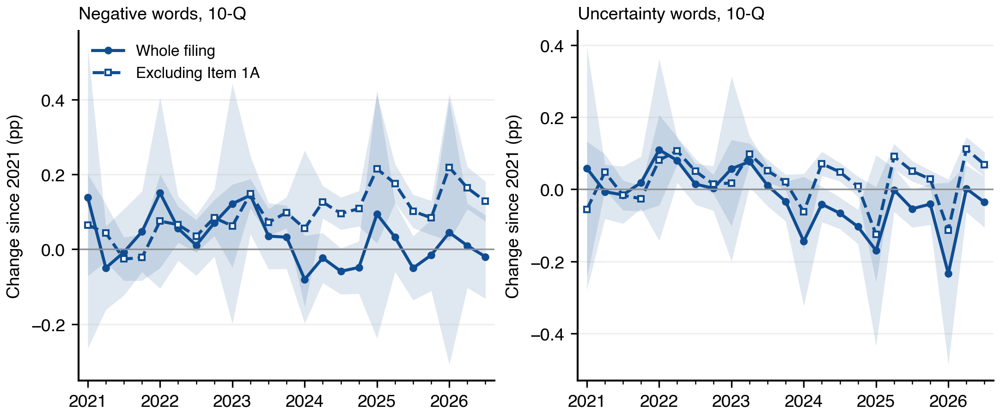
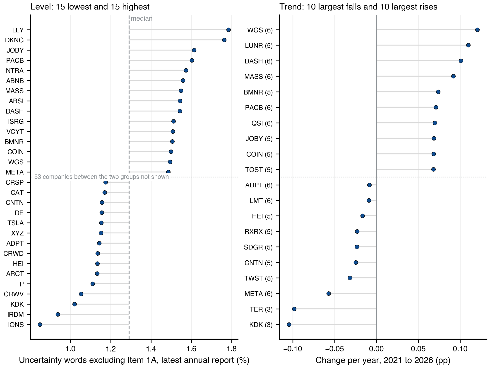
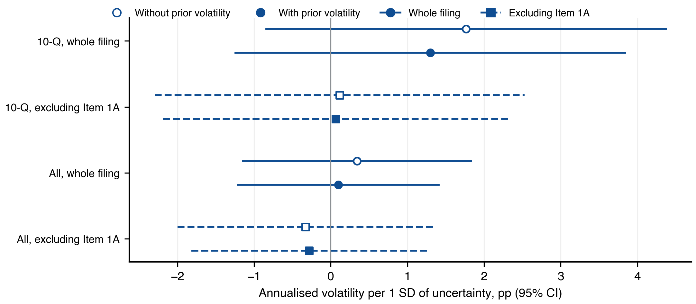
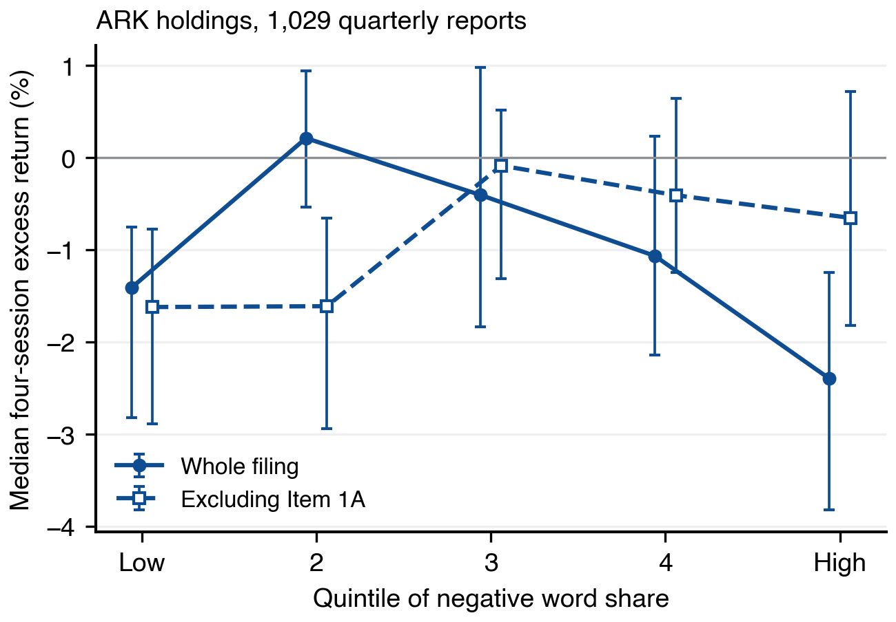
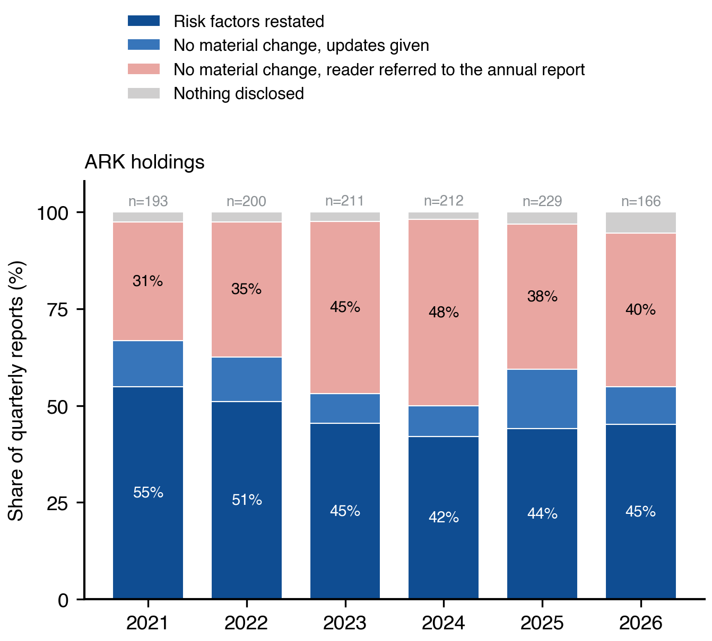

# Appendix: Uncertainty and Sentiment in the Filings of ARK ETF Holdings

Methods, supplementary figures and supplementary tables for the report of the same title. Section A gives every specification; Sections B and C hold the exhibits the report cites.

## A. Methods

### Word lists and parsing

Word lists are the entries with a positive year in the Negative and Uncertainty columns of the Loughran-McDonald Master Dictionary, 1993 to 2025 release, updated March 2026: 2,345 and 297 words. Filing text is the primary document with hidden inline-XBRL content removed and tables dropped where more than 15% of non-space characters are digits. Tokens are alphabetic strings of at least two characters, uppercased. Exhibits and material incorporated by reference are not recovered.

### Scores

$$
P_{cj}=\frac{\sum_{i \in c} tf_{ij}}{W_j}
$$

$$
T_{cj}=\sum_{i \in c,\, tf_{ij}>0}\frac{1+\ln(tf_{ij})}{1+\ln(a_j)}\,\ln\!\left(\frac{N}{df_i}\right)
$$

P is the word share of list c in filing j and W the filing's word count. T is equation (1) of Loughran and McDonald (2011): tf is the count of word i in filing j, a the filing's average word frequency (words divided by distinct words), N the number of filings in the estimation corpus and df the number containing word i. Logarithms are natural. Document frequencies are fitted within each sample (ARK holdings, QQQ holdings), so tf.idf scores are comparable across filings within a sample and not across samples.

### Locating Item 1A

The section opens at an occurrence of the heading Item 1A followed by Risk Factors that satisfies four conditions, and the last such occurrence in the filing is taken:

- It is not preceded within 60 characters by a reference cue such as in, see, under or Part I.
- It is not followed within 90 characters by another item number, which marks a table of contents or a cross-reference index.
- It is followed by text opening with a capital letter, since a citation continues with a lowercase word or a punctuation mark.
- It carries the item label; filers who head the section Risk Factors alone are recorded as not located.

The section closes at the next item heading whose title is also present, such as Item 1B Unresolved Staff Comments or Item 2 Unregistered Sales. A bare SIGNATURES line is not treated as a closing marker. Disclosure mode is read from the section's first 800 characters and its length: sections over 400 words are full restatements unless they claim no material change, in which case they are partial updates; shorter sections that claim no material change or point to the annual report are reference-only; shorter sections that do neither are recorded as nothing disclosed. Every statistic on the section is computed on the text sample, so the section exhibits and the tone exhibits describe the same filings.

### Decomposition

$$
S = w\,S_{\mathrm{risk}} + (1-w)\,S_{\mathrm{body}}
$$

$$
\Delta S = \bar w\,\Delta S_{\mathrm{risk}} + (1-\bar w)\,\Delta S_{\mathrm{body}} \;+\; \Delta w\,(\bar S_{\mathrm{risk}} - \bar S_{\mathrm{body}})
$$

w is Item 1A's share of the filing's words and bars denote the mean over the two filings being compared. The first two terms are the language term and the third the composition term; the identity is exact. Comparisons are within company and within form. The language term inherits the high uncertainty density of a one-sentence pointer, so the change in the filing excluding Item 1A is the statistic to read (Table C11).

### Event windows and controls

Day 0 is the first NYSE session on or after the later of the filing date and the EDGAR acceptance date, with acceptance at or after the close moved to the next session. The filing-period return is the adjusted close on day 3 over the adjusted close on day -1, less the same ratio for SPY. Prior volatility is the sample standard deviation of 55 daily returns over days -60 to -6, annualised; post-filing volatility uses 60 returns over days 4 to 63. Size is the nominal close on day -1 times the cover-page share count of the filing being scored, from the XBRL fact EntityCommonStockSharesOutstanding. Dollar volume is the mean of nominal close times volume over days -60 to -6. Prior excess return is the SPY-adjusted buy-and-hold return over the same window. Filings with a day -1 price below three dollars are excluded. The outcome regressions carry company and calendar-quarter effects, log size, log dollar volume, prior excess return and, where stated, prior volatility.

### Regressions and inference

The aggregate trend model regresses the quarterly mean on elapsed years and three seasonal indicators, with ordinary and Newey-West (four lags) standard errors. The within-company model adds company effects to filing-level observations. Saturated calendar-quarter effects are not used in trend models because they absorb the trend. Standard errors in all filing-level regressions are clustered two ways by company and calendar quarter, with inference degrees of freedom one fewer than the smaller cluster count; where that covariance is not positive definite the report marks the cell and uses company clusters alone. Effects per standard deviation use the standard deviation of the measure in the estimation sample. The detectable effect is the coefficient that a two-sided 5% test would find with 80% power at the estimated standard error. An indicator regressor identified by fewer than ten filings is reported as not estimable.

### The comparison with QQQ holdings

QQQ tracks the Nasdaq-100; its holdings are the 102 constituents of 9 September 2026, which the same filters reduce to 94 SEC filers. Each result in Section 7 of the report is a single regression on the companies held by only one portfolio, 22 companies held by both being excluded so that no filing sits on both sides: the coefficient on a QQQ indicator for a level difference (calendar-quarter effects, seasonal indicators), on its interaction with elapsed years for a trend difference, and on its interaction with the measure for a difference in an outcome coefficient (company and calendar-quarter effects, the outcome regressions' controls). A significant estimate in one portfolio beside an insignificant one in the other is never read as a difference. QQQ's own exhibits, computed on all its holdings including the shared companies, are Tables C4 to C7.

## B. Supplementary figures

*Figure B1. ARK quarterly reports, whole filing (solid) and excluding Item 1A (dashed), company-centred means as change since 2021 with 95% bands. The whole-filing line is flat while the line excluding Item 1A rises for negative words (Table 7).*

*Figure B2. ARK holdings ranked on uncertainty words excluding Item 1A. Left: latest annual report with a located Item 1A, 15 lowest and 15 highest of 83 companies; dashed line, the median. Right: within-company slope over 2021 to 2026, the 10 largest falls and 10 largest rises among the 71 companies with at least three such reports (number of reports in brackets); slopes rest on three to six observations and rank companies. Table C8 lists every company.*

*Figure B3. Effect of one standard deviation of uncertainty word share on annualised volatility with 95% intervals, ARK quarterly reports and all reports with a located Item 1A, without (hollow) and with (filled) prior volatility, whole filing (circles) and excluding Item 1A (squares). Annual reports alone are omitted; their intervals span tens of percentage points.*

*Figure B4. Median four-session excess return by quintile of negative word share, ARK quarterly reports with a located Item 1A and complete market data, whole filing and excluding Item 1A, with bootstrap 95% intervals. The design follows Figure 1 of Loughran and McDonald (2011).*

*Figure B5. Disclosure mode of Item 1A in ARK quarterly reports with a located heading, by filing year; 2026 covers filings through September.*

*Figure B6. Both measures by quarter, ARK holdings and QQQ holdings (each including the shared companies), company-centred means with 95% bands; annual reports by filing year.*

*Figure B7. Company-mean word shares in annual reports with a located Item 1A, ARK-only against QQQ-only companies, whole filing and excluding Item 1A. Boxes span the interquartile range, whiskers the 5th to 95th percentile, dots are companies. The level rows of Table 8 test these differences.*

## C. Supplementary tables

### Table C1. Disclosure mode by year, quarterly reports (%)

*Shares of all quarterly reports in the text sample, including those with no located heading.*

| Portfolio    | Year   | Reports   | Risk factors restated   | No material change, updates given   | No material change, reader referred to the annual report   | Nothing disclosed   | No Item 1A heading located   |
|:-------------|:-------|:----------|:------------------------|:------------------------------------|:-----------------------------------------------------------|:--------------------|:-----------------------------|
| ARK holdings | 2021   | 209       | 50.7                    | 11.0                                | 28.2                                                       | 2.4                 | 7.7                          |
| ARK holdings | 2022   | 224       | 45.5                    | 10.3                                | 31.2                                                       | 2.2                 | 10.7                         |
| ARK holdings | 2023   | 233       | 41.2                    | 6.9                                 | 40.3                                                       | 2.1                 | 9.4                          |
| ARK holdings | 2024   | 237       | 37.6                    | 7.2                                 | 43.0                                                       | 1.7                 | 10.5                         |
| ARK holdings | 2025   | 253       | 39.9                    | 13.8                                | 34.0                                                       | 2.8                 | 9.5                          |
| ARK holdings | 2026   | 187       | 40.1                    | 8.6                                 | 35.3                                                       | 4.8                 | 11.2                         |
| QQQ holdings | 2021   | 255       | 50.6                    | 6.3                                 | 34.5                                                       | 5.1                 | 3.5                          |
| QQQ holdings | 2022   | 257       | 49.0                    | 10.9                                | 26.5                                                       | 8.6                 | 5.1                          |
| QQQ holdings | 2023   | 260       | 41.5                    | 8.1                                 | 34.6                                                       | 8.5                 | 7.3                          |
| QQQ holdings | 2024   | 261       | 39.1                    | 4.6                                 | 41.0                                                       | 7.3                 | 8.0                          |
| QQQ holdings | 2025   | 271       | 41.7                    | 7.7                                 | 36.5                                                       | 6.3                 | 7.7                          |
| QQQ holdings | 2026   | 190       | 39.5                    | 10.0                                | 36.8                                                       | 6.8                 | 6.8                          |

### Table C2. ARK holdings: disclosure switches and market outcomes

*Same controls and clustering as Tables 5 and 6. Treated: filings with the indicator on. An indicator identified by fewer than ten filings is not estimated.*

| Report   | Outcome                                  | Regressor             | Filings   | Treated   | Estimate (pp)   | SE   | p     | Status        |
|:---------|:-----------------------------------------|:----------------------|:----------|:----------|:----------------|:-----|:------|:--------------|
| All      | Four-session excess return               | Stopped restating     | 1,257     | 69        | +2.86           | 1.75 | 0.118 |               |
| All      | Post-filing volatility, prior controlled | Stopped restating     | 1,189     | 66        | -0.03           | 2.94 | 0.991 |               |
| All      | Four-session excess return               | Started restating     | 1,257     | 60        | -0.37           | 1.65 | 0.825 |               |
| All      | Post-filing volatility, prior controlled | Started restating     | 1,189     | 55        | -1.32           | 1.89 | 0.493 |               |
| All      | Four-session excess return               | Restates this quarter | 1,257     | 415       | -0.23           | 0.93 | 0.806 |               |
| All      | Post-filing volatility, prior controlled | Restates this quarter | 1,189     | 385       | -0.17           | 2.05 | 0.933 |               |
| 10-K     | Four-session excess return               | Stopped restating     | 282       |           |                 |      | n.e.  | not estimable |
| 10-K     | Post-filing volatility, prior controlled | Stopped restating     | 281       |           |                 |      | n.e.  | not estimable |
| 10-K     | Four-session excess return               | Started restating     | 282       |           |                 |      | n.e.  | not estimable |
| 10-K     | Post-filing volatility, prior controlled | Started restating     | 281       |           |                 |      | n.e.  | not estimable |
| 10-K     | Four-session excess return               | Restates this quarter | 282       |           |                 |      | n.e.  | not estimable |
| 10-K     | Post-filing volatility, prior controlled | Restates this quarter | 281       |           |                 |      | n.e.  | not estimable |
| 10-Q     | Four-session excess return               | Stopped restating     | 975       | 69        | +3.00           | 1.68 | 0.089 |               |
| 10-Q     | Post-filing volatility, prior controlled | Stopped restating     | 908       | 66        | -1.49           | 3.30 | 0.655 |               |
| 10-Q     | Four-session excess return               | Started restating     | 975       | 60        | -0.06           | 1.82 | 0.973 |               |
| 10-Q     | Post-filing volatility, prior controlled | Started restating     | 908       | 55        | -2.09           | 2.00 | 0.308 |               |
| 10-Q     | Four-session excess return               | Restates this quarter | 975       | 415       | -1.00           | 1.04 | 0.347 |               |
| 10-Q     | Post-filing volatility, prior controlled | Restates this quarter | 908       | 385       | +1.02           | 2.70 | 0.709 |               |

### Table C3. ARK holdings: aggregate trend, ordinary against Newey-West standard errors

| Report   | Measure                 | Standard errors    | Slope per year   | t     | p       |
|:---------|:------------------------|:-------------------|:-----------------|:------|:--------|
| 10-K     | Negative, word share    | Ordinary           | +0.061           | 8.94  | < 0.001 |
| 10-K     | Negative, word share    | Newey-West, 4 lags | +0.061           | 9.68  | < 0.001 |
| 10-K     | Uncertainty, word share | Ordinary           | +0.024           | 4.02  | 0.001   |
| 10-K     | Uncertainty, word share | Newey-West, 4 lags | +0.024           | 4.48  | < 0.001 |
| 10-K     | Negative, tf.idf        | Ordinary           | +2.992           | 2.43  | 0.030   |
| 10-K     | Negative, tf.idf        | Newey-West, 4 lags | +2.992           | 2.80  | 0.015   |
| 10-K     | Uncertainty, tf.idf     | Ordinary           | -0.231           | -1.05 | 0.313   |
| 10-K     | Uncertainty, tf.idf     | Newey-West, 4 lags | -0.231           | -1.23 | 0.241   |
| 10-Q     | Negative, word share    | Ordinary           | -0.015           | -1.42 | 0.173   |
| 10-Q     | Negative, word share    | Newey-West, 4 lags | -0.015           | -1.77 | 0.093   |
| 10-Q     | Uncertainty, word share | Ordinary           | -0.033           | -3.02 | 0.007   |
| 10-Q     | Uncertainty, word share | Newey-West, 4 lags | -0.033           | -3.71 | 0.002   |
| 10-Q     | Negative, tf.idf        | Ordinary           | -1.243           | -1.57 | 0.134   |
| 10-Q     | Negative, tf.idf        | Newey-West, 4 lags | -1.243           | -1.57 | 0.134   |
| 10-Q     | Uncertainty, tf.idf     | Ordinary           | -0.431           | -3.24 | 0.005   |
| 10-Q     | Uncertainty, tf.idf     | Newey-West, 4 lags | -0.431           | -3.13 | 0.006   |

### Table C4. QQQ holdings: summary statistics by report type

*tf.idf fitted on the QQQ corpus.*

| Form   | Measure                 | N     | Mean    | SD     | P25     | Median   | P75     |
|:-------|:------------------------|:------|:--------|:-------|:--------|:---------|:--------|
| 10-K   | Negative, word share    | 518   | 2.073   | 0.438  | 1.790   | 2.065    | 2.373   |
| 10-K   | Uncertainty, word share | 518   | 1.806   | 0.292  | 1.623   | 1.824    | 2.019   |
| 10-K   | Negative, tf.idf        | 518   | 139.315 | 49.956 | 104.510 | 132.289  | 164.273 |
| 10-K   | Uncertainty, tf.idf     | 518   | 24.671  | 7.381  | 19.308  | 24.377   | 29.231  |
| 10-Q   | Negative, word share    | 1,494 | 2.003   | 0.884  | 1.208   | 1.825    | 2.759   |
| 10-Q   | Uncertainty, word share | 1,494 | 1.722   | 0.594  | 1.239   | 1.540    | 2.238   |
| 10-Q   | Negative, tf.idf        | 1,494 | 72.226  | 56.303 | 23.310  | 51.265   | 114.335 |
| 10-Q   | Uncertainty, tf.idf     | 1,494 | 12.715  | 6.845  | 6.938   | 11.322   | 17.435  |

### Table C5. QQQ holdings: trend tests, aggregate and within company

| Report   | Measure                 | Aggregate slope   | Newey-West t   | Within-company slope   | t     | p       | Filings   |
|:---------|:------------------------|:------------------|:---------------|:-----------------------|:------|:--------|:----------|
| 10-K     | Negative, word share    | +0.052            | 9.95           | +0.041                 | 6.64  | < 0.001 | 518       |
| 10-K     | Uncertainty, word share | +0.027            | 4.02           | +0.024                 | 8.45  | < 0.001 | 518       |
| 10-K     | Negative, tf.idf        | +2.263            | 4.13           | +1.294                 | 3.14  | 0.005   | 518       |
| 10-K     | Uncertainty, tf.idf     | -0.262            | -2.29          | -0.200                 | -2.04 | 0.053   | 518       |
| 10-Q     | Negative, word share    | -0.012            | -1.89          | -0.002                 | -0.13 | 0.900   | 1,494     |
| 10-Q     | Uncertainty, word share | -0.013            | -6.49          | -0.008                 | -0.85 | 0.404   | 1,494     |
| 10-Q     | Negative, tf.idf        | -1.134            | -8.70          | -0.750                 | -0.74 | 0.468   | 1,494     |
| 10-Q     | Uncertainty, tf.idf     | -0.510            | -5.64          | -0.463                 | -3.39 | 0.003   | 1,494     |

### Table C6. QQQ holdings: post-filing volatility on uncertainty

| Report   | Measure                 | Prior volatility   | Filings   | Effect per SD (pp)   | Detectable (pp)   | p     |
|:---------|:------------------------|:-------------------|:----------|:---------------------|:------------------|:------|
| All      | Uncertainty, word share | No                 | 1,863     | -0.09                | 1.64              | 0.871 |
| All      | Uncertainty, word share | Yes                | 1,863     | -0.07                | 1.49              | 0.899 |
| All      | Uncertainty, tf.idf     | No                 | 1,863     | -1.36                | 2.97              | 0.194 |
| All      | Uncertainty, tf.idf     | Yes                | 1,863     | -1.40                | 2.82              | 0.162 |
| 10-K     | Uncertainty, word share | No                 | 489       | +0.30                | 6.25              | 0.889 |
| 10-K     | Uncertainty, word share | Yes                | 489       | -0.08                | 4.66              | 0.960 |
| 10-K     | Uncertainty, tf.idf     | No                 | 489       | -3.17                | 6.56              | 0.173 |
| 10-K     | Uncertainty, tf.idf     | Yes                | 489       | -2.98                | 5.63              | 0.137 |
| 10-Q     | Uncertainty, word share | No                 | 1,374     | +0.24                | 2.52              | 0.781 |
| 10-Q     | Uncertainty, word share | Yes                | 1,374     | +0.17                | 2.27              | 0.832 |
| 10-Q     | Uncertainty, tf.idf     | No                 | 1,374     | +0.33                | 3.31              | 0.776 |
| 10-Q     | Uncertainty, tf.idf     | Yes                | 1,374     | +0.25                | 3.02              | 0.809 |

### Table C7. QQQ holdings: four-session excess return on negative tone

| Report   | Measure              | Filings   | Effect per SD (pp)   | Detectable (pp)   | p     |
|:---------|:---------------------|:----------|:---------------------|:------------------|:------|
| All      | Negative, word share | 1,947     | +0.26                | 0.74              | 0.323 |
| All      | Negative, tf.idf     | 1,947     | +0.78                | 1.12              | 0.055 |
| 10-K     | Negative, word share | 499       | +1.20                | 4.92              | 0.486 |
| 10-K     | Negative, tf.idf     | 499       | +1.34                | 5.22              | 0.463 |
| 10-Q     | Negative, word share | 1,448     | +0.46                | 1.57              | 0.401 |
| 10-Q     | Negative, tf.idf     | 1,448     | +0.94                | 2.28              | 0.241 |

### Table C8. ARK holdings: uncertainty words excluding Item 1A, every company

*Filed: the latest annual report with a located Item 1A. Slopes over all such reports, where at least three exist.*

| Ticker   | Filed      | Latest annual report (%)   | Slope per year (pp)   | Annual reports   |
|:---------|:-----------|:---------------------------|:----------------------|:-----------------|
| LLY      | 2026-02-12 | 1.78                       | +0.041                | 6                |
| DKNG     | 2026-02-13 | 1.76                       | +0.035                | 4                |
| JOBY     | 2026-02-27 | 1.61                       | +0.069                | 5                |
| PACB     | 2026-02-25 | 1.60                       | +0.071                | 6                |
| NTRA     | 2026-02-27 | 1.57                       | +0.036                | 6                |
| ABNB     | 2026-02-12 | 1.56                       | +0.038                | 6                |
| MASS     | 2026-03-09 | 1.55                       | +0.092                | 6                |
| ABSI     | 2026-03-24 | 1.54                       | +0.044                | 5                |
| DASH     | 2026-02-18 | 1.54                       | +0.101                | 6                |
| ISRG     | 2026-02-03 | 1.51                       | +0.003                | 6                |
| VCYT     | 2026-02-26 | 1.51                       | +0.004                | 6                |
| BMNR     | 2025-11-21 | 1.51                       | +0.074                | 5                |
| COIN     | 2026-02-12 | 1.50                       | +0.068                | 5                |
| WGS      | 2026-02-23 | 1.49                       | +0.121                | 6                |
| META     | 2026-01-29 | 1.49                       | -0.057                | 6                |
| TDY      | 2026-02-20 | 1.48                       | +0.011                | 6                |
| CERS     | 2021-02-25 | 1.47                       |                       |                  |
| KTOS     | 2026-02-23 | 1.47                       | +0.007                | 6                |
| GH       | 2026-02-19 | 1.45                       | +0.010                | 6                |
| LMT      | 2026-01-29 | 1.45                       | -0.009                | 6                |
| TXG      | 2026-02-13 | 1.44                       | +0.063                | 6                |
| NFLX     | 2026-01-23 | 1.44                       | +0.027                | 6                |
| SHOP     | 2026-02-11 | 1.43                       |                       |                  |
| TOST     | 2026-02-18 | 1.43                       | +0.068                | 5                |
| Z        | 2026-02-11 | 1.43                       | +0.063                | 6                |
| CRCL     | 2026-03-09 | 1.42                       |                       |                  |
| DDOG     | 2026-02-18 | 1.41                       | +0.020                | 5                |
| AVGO     | 2025-12-18 | 1.39                       | -0.008                | 5                |
| QSI      | 2026-03-03 | 1.38                       | +0.070                | 6                |
| RKLB     | 2026-02-26 | 1.38                       | +0.059                | 3                |
| GOOG     | 2026-02-05 | 1.36                       | +0.006                | 6                |
| PSNL     | 2022-02-24 | 1.36                       |                       |                  |
| HOOD     | 2026-02-18 | 1.36                       | +0.038                | 5                |
| NET      | 2026-02-26 | 1.35                       | +0.025                | 6                |
| LUNR     | 2026-03-19 | 1.35                       | +0.110                | 5                |
| BWXT     | 2026-02-23 | 1.34                       | -0.005                | 6                |
| RXRX     | 2026-02-25 | 1.34                       | -0.023                | 5                |
| CDNA     | 2026-02-25 | 1.34                       | +0.011                | 6                |
| OKLO     | 2026-03-17 | 1.33                       | +0.041                | 5                |
| SNPS     | 2025-12-22 | 1.32                       | +0.024                | 5                |
| BEAM     | 2026-02-24 | 1.30                       | +0.020                | 3                |
| GTLB     | 2026-03-17 | 1.29                       | -0.000                | 5                |
| AVAV     | 2026-06-29 | 1.29                       | -0.003                | 6                |
| AMZN     | 2026-02-06 | 1.29                       | -0.004                | 6                |
| RBRK     | 2026-03-19 | 1.27                       |                       |                  |
| TWST     | 2025-11-17 | 1.26                       | -0.032                | 5                |
| NTLA     | 2026-02-26 | 1.26                       |                       |                  |
| SDGR     | 2026-02-25 | 1.25                       | -0.023                | 5                |
| GRMN     | 2021-02-17 | 1.25                       |                       |                  |
| RBLX     | 2026-02-11 | 1.24                       | +0.001                | 5                |
| NVDA     | 2026-02-25 | 1.24                       | +0.005                | 6                |
| CMPS     | 2026-03-24 | 1.24                       | +0.014                | 5                |
| SYM      | 2025-11-24 | 1.24                       | +0.034                | 5                |
| AUR      | 2026-02-11 | 1.23                       | -0.006                | 5                |
| MELI     | 2026-02-25 | 1.23                       | -0.003                | 6                |
| TER      | 2023-02-22 | 1.23                       | -0.098                | 3                |
| SNOW     | 2026-03-20 | 1.22                       | +0.052                | 6                |
| TRMB     | 2026-02-25 | 1.21                       | +0.006                | 6                |
| ACHR     | 2026-03-02 | 1.21                       | +0.018                | 6                |
| FRNM     | 2026-03-12 | 1.21                       |                       |                  |
| BFLY     | 2026-02-27 | 1.20                       | +0.028                | 6                |
| AMD      | 2026-02-04 | 1.19                       | +0.039                | 6                |
| SOFI     | 2026-02-17 | 1.19                       | +0.012                | 5                |
| LHX      | 2026-02-12 | 1.19                       | +0.004                | 6                |
| PRME     | 2026-03-03 | 1.19                       | +0.009                | 4                |
| FIG      | 2026-02-18 | 1.18                       |                       |                  |
| PLTR     | 2026-02-17 | 1.18                       | +0.056                | 6                |
| NRIX     | 2026-01-28 | 1.18                       | +0.009                | 5                |
| CRSP     | 2021-02-16 | 1.17                       |                       |                  |
| CAT      | 2026-02-13 | 1.17                       | +0.028                | 6                |
| CNTN     | 2026-03-31 | 1.16                       | -0.025                | 5                |
| DE       | 2025-12-18 | 1.16                       | +0.025                | 5                |
| TSLA     | 2026-01-29 | 1.15                       | +0.036                | 6                |
| XYZ      | 2026-02-26 | 1.15                       | +0.012                | 6                |
| ADPT     | 2026-02-26 | 1.14                       | -0.008                | 6                |
| CRWD     | 2026-03-05 | 1.14                       | +0.027                | 6                |
| HEI      | 2025-12-22 | 1.13                       | -0.017                | 5                |
| ARCT     | 2022-03-01 | 1.13                       |                       |                  |
| P        | 2026-03-25 | 1.11                       | +0.001                | 6                |
| CRWV     | 2026-03-02 | 1.05                       |                       |                  |
| KDK      | 2026-03-11 | 1.02                       | -0.105                | 3                |
| IRDM     | 2026-02-12 | 0.94                       | +0.012                | 6                |
| IONS     | 2026-02-26 | 0.85                       | +0.002                | 6                |

### Table C9. ARK holdings: the 20 largest disclosure switches in quarterly reports, of 158

*Ranked by the change in Item 1A words. The full list is in the data workbook.*

| Ticker   | Filed      | Transition        | Item 1A words before   | Item 1A words after   | Uncertainty change (pp)   | Change excl. Item 1A (pp)   |
|:---------|:-----------|:------------------|:-----------------------|:----------------------|:--------------------------|:----------------------------|
| PRME     | 2023-08-07 | Stopped restating | 49,292                 | 75                    | -1.573                    | -0.285                      |
| COIN     | 2026-05-07 | Stopped restating | 42,072                 | 138                   | -1.004                    | +0.051                      |
| TXG      | 2025-08-08 | Stopped restating | 39,630                 | 57                    | -1.625                    | -0.323                      |
| TOST     | 2024-05-08 | Stopped restating | 33,026                 | 188                   | -1.225                    | +0.229                      |
| RXRX     | 2022-05-10 | Stopped restating | 32,188                 | 26                    | -1.232                    | -0.070                      |
| ABSI     | 2022-05-11 | Stopped restating | 31,789                 | 134                   | -1.096                    | +0.128                      |
| VCYT     | 2025-05-08 | Stopped restating | 31,137                 | 57                    | -0.815                    | -0.095                      |
| TXG      | 2022-05-05 | Stopped restating | 29,175                 | 55                    | -0.882                    | +0.098                      |
| QSI      | 2021-11-15 | Stopped restating | 26,336                 | 64                    | -1.263                    | -0.049                      |
| MASS     | 2022-05-10 | Stopped restating | 26,115                 | 74                    | -1.045                    | +0.164                      |
| AUR      | 2024-05-09 | Stopped restating | 23,941                 | 67                    | -1.221                    | +0.316                      |
| TSLA     | 2023-04-24 | Stopped restating | 13,216                 | 43                    | -0.882                    | -0.012                      |
| ACHR     | 2021-08-16 | Started restating | 28                     | 12,007                | +0.868                    | +0.041                      |
| AUR      | 2022-05-12 | Started restating | 138                    | 21,823                | +1.815                    | +0.500                      |
| MASS     | 2021-11-04 | Started restating | 74                     | 26,115                | +1.201                    | -0.010                      |
| QSI      | 2021-08-16 | Started restating | 130                    | 26,336                | +1.300                    | +0.132                      |
| WGS      | 2021-11-15 | Started restating | 131                    | 34,121                | +1.415                    | +0.159                      |
| SOFI     | 2021-08-16 | Started restating | 134                    | 36,200                | +0.941                    | +0.301                      |
| ABSI     | 2025-05-13 | Started restating | 134                    | 38,588                | +1.587                    | +0.389                      |
| TXG      | 2025-05-09 | Started restating | 52                     | 39,630                | +1.433                    | +0.128                      |

### Table C10. Share of filings with a located Item 1A heading

| Group    | 10-K (%)   | 10-Q (%)   |
|:---------|:-----------|:-----------|
| ARK only | 87.8       | 87.1       |
| Both     | 93.6       | 100.0      |
| QQQ only | 92.9       | 91.8       |

### Table C11. Filing-to-filing change in word share by disclosure transition

*Quarterly reports, each compared with the same company's previous quarterly report. The language and composition terms sum to the change.*

| Portfolio    | Measure     | Transition        | Filings   | Companies   | Change (pp)   | Change excl. Item 1A (pp)   | Language term (pp)   | Composition term (pp)   | Median change in Item 1A words   |
|:-------------|:------------|:------------------|:----------|:------------|:--------------|:----------------------------|:---------------------|:------------------------|:---------------------------------|
| ARK holdings | Negative    | Kept restating    | 567       | 67          | +0.009        | +0.010                      | +0.013               | -0.004                  | 157                              |
| ARK holdings | Negative    | Kept referring    | 398       | 48          | -0.000        | -0.000                      | +0.000               | -0.000                  | 0                                |
| ARK holdings | Negative    | Started restating | 77        | 33          | +0.344        | +0.039                      | +0.146               | +0.198                  | 668                              |
| ARK holdings | Negative    | Stopped restating | 81        | 36          | -0.380        | -0.003                      | -0.167               | -0.213                  | -835                             |
| ARK holdings | Uncertainty | Kept restating    | 567       | 67          | +0.001        | +0.004                      | +0.004               | -0.003                  | 157                              |
| ARK holdings | Uncertainty | Kept referring    | 398       | 48          | -0.009        | -0.008                      | -0.009               | -0.000                  | 0                                |
| ARK holdings | Uncertainty | Started restating | 77        | 33          | +0.230        | +0.025                      | -0.201               | +0.431                  | 668                              |
| ARK holdings | Uncertainty | Stopped restating | 81        | 36          | -0.207        | +0.052                      | +0.346               | -0.553                  | -835                             |
| QQQ holdings | Negative    | Kept restating    | 659       | 64          | +0.009        | -0.002                      | +0.004               | +0.005                  | 101                              |
| QQQ holdings | Negative    | Kept referring    | 528       | 52          | -0.016        | -0.016                      | -0.016               | +0.000                  | 0                                |
| QQQ holdings | Negative    | Started restating | 61        | 33          | +0.282        | +0.006                      | +0.156               | +0.126                  | 551                              |
| QQQ holdings | Negative    | Stopped restating | 59        | 34          | -0.265        | +0.011                      | -0.108               | -0.158                  | -581                             |
| QQQ holdings | Uncertainty | Kept restating    | 659       | 64          | -0.000        | -0.002                      | -0.004               | +0.004                  | 101                              |
| QQQ holdings | Uncertainty | Kept referring    | 528       | 52          | -0.007        | -0.007                      | -0.007               | +0.000                  | 0                                |
| QQQ holdings | Uncertainty | Started restating | 61        | 33          | +0.142        | -0.032                      | -0.169               | +0.311                  | 551                              |
| QQQ holdings | Uncertainty | Stopped restating | 59        | 34          | -0.160        | +0.052                      | +0.218               | -0.378                  | -581                             |

### Table C12. QQQ less ARK: levels and trends, whole filing and excluding Item 1A

*One regression per row on the disjoint sample, filings with a located Item 1A. Two-way clustered inference; Table 8 falls back to company clusters where the status column is marked.*

| Report   | Measure        | Scope                  | Quantity          | QQQ less ARK   | p       | Filings   | Status                           |
|:---------|:---------------|:-----------------------|:------------------|:---------------|:--------|:----------|:---------------------------------|
| All      | Negative       | whole filing           | Level (pp)        | -0.1178        | 0.335   | 2,653     |                                  |
| All      | Negative       | whole filing           | Trend (pp a year) | -0.0231        | 0.234   | 2,653     |                                  |
| All      | Negative       | excluding Item 1A      | Level (pp)        | +0.0244        | 0.753   | 2,653     |                                  |
| All      | Negative       | excluding Item 1A      | Trend (pp a year) | -0.0392        | 0.014   | 2,653     |                                  |
| All      | Uncertainty    | whole filing           | Level (pp)        | -0.1407        | 0.074   | 2,653     |                                  |
| All      | Uncertainty    | whole filing           | Trend (pp a year) | -0.0136        | 0.233   | 2,653     |                                  |
| All      | Uncertainty    | excluding Item 1A      | Level (pp)        | -0.0614        | 0.088   | 2,653     |                                  |
| All      | Uncertainty    | excluding Item 1A      | Trend (pp a year) | -0.0154        | 0.060   | 2,653     |                                  |
| All      | Section length | Item 1A share of words | Level (pp)        | -5.7572        | 0.114   | 2,653     |                                  |
| All      | Section length | Item 1A share of words | Trend (pp a year) | +0.1423        | 0.794   | 2,653     |                                  |
| 10-K     | Negative       | whole filing           | Level (pp)        | -0.2733        | 0.003   | 682       |                                  |
| 10-K     | Negative       | whole filing           | Trend (pp a year) | -0.0155        | 0.222   | 682       |                                  |
| 10-K     | Negative       | excluding Item 1A      | Level (pp)        | -0.0512        | 0.383   | 682       |                                  |
| 10-K     | Negative       | excluding Item 1A      | Trend (pp a year) | -0.0340        | n.e.    | 682       | covariance not positive definite |
| 10-K     | Uncertainty    | whole filing           | Level (pp)        | -0.2005        | < 0.001 | 682       |                                  |
| 10-K     | Uncertainty    | whole filing           | Trend (pp a year) | -0.0070        | 0.001   | 682       |                                  |
| 10-K     | Uncertainty    | excluding Item 1A      | Level (pp)        | -0.0080        | 0.786   | 682       |                                  |
| 10-K     | Uncertainty    | excluding Item 1A      | Trend (pp a year) | -0.0068        | n.e.    | 682       | covariance not positive definite |
| 10-K     | Section length | Item 1A share of words | Level (pp)        | -7.9891        | 0.006   | 682       |                                  |
| 10-K     | Section length | Item 1A share of words | Trend (pp a year) | +0.0880        | 0.814   | 682       |                                  |
| 10-Q     | Negative       | whole filing           | Level (pp)        | -0.0811        | 0.583   | 1,971     |                                  |
| 10-Q     | Negative       | whole filing           | Trend (pp a year) | -0.0268        | 0.310   | 1,971     |                                  |
| 10-Q     | Negative       | excluding Item 1A      | Level (pp)        | +0.0620        | 0.485   | 1,971     |                                  |
| 10-Q     | Negative       | excluding Item 1A      | Trend (pp a year) | -0.0413        | 0.008   | 1,971     |                                  |
| 10-Q     | Uncertainty    | whole filing           | Level (pp)        | -0.1401        | 0.149   | 1,971     |                                  |
| 10-Q     | Uncertainty    | whole filing           | Trend (pp a year) | -0.0146        | 0.414   | 1,971     |                                  |
| 10-Q     | Uncertainty    | excluding Item 1A      | Level (pp)        | -0.0777        | 0.060   | 1,971     |                                  |
| 10-Q     | Uncertainty    | excluding Item 1A      | Trend (pp a year) | -0.0141        | 0.148   | 1,971     |                                  |
| 10-Q     | Section length | Item 1A share of words | Level (pp)        | -5.8511        | 0.193   | 1,971     |                                  |
| 10-Q     | Section length | Item 1A share of words | Trend (pp a year) | +0.1612        | 0.843   | 1,971     |                                  |

### Table C13. QQQ less ARK: difference in the volatility and return coefficients

*Interaction of the measure with a QQQ indicator, one regression per row on the disjoint sample; all filings for the rows so marked, otherwise filings with a located Item 1A.*

| Outcome                    | Report   | Scope             | Measure                 | Prior volatility   | QQQ less ARK (pp per SD)   | p       | Filings   |
|:---------------------------|:---------|:------------------|:------------------------|:-------------------|:---------------------------|:--------|:----------|
| Post-filing volatility     | All      | all filings       | Uncertainty, word share | No                 | -0.77                      | 0.427   | 2,616     |
| Post-filing volatility     | All      | all filings       | Uncertainty, word share | Yes                | -0.32                      | 0.694   | 2,616     |
| Post-filing volatility     | All      | all filings       | Uncertainty, tf.idf     | No                 | -1.43                      | 0.314   | 2,616     |
| Post-filing volatility     | All      | all filings       | Uncertainty, tf.idf     | Yes                | -1.27                      | 0.312   | 2,616     |
| Post-filing volatility     | All      | whole filing      | Uncertainty, word share | No                 | -0.75                      | 0.447   | 2,352     |
| Post-filing volatility     | All      | whole filing      | Uncertainty, word share | Yes                | -0.31                      | 0.715   | 2,352     |
| Post-filing volatility     | All      | excluding Item 1A | Uncertainty, word share | No                 | -0.38                      | 0.780   | 2,352     |
| Post-filing volatility     | All      | excluding Item 1A | Uncertainty, word share | Yes                | -0.26                      | 0.830   | 2,352     |
| Post-filing volatility     | 10-K     | all filings       | Uncertainty, word share | No                 | +11.64                     | 0.004   | 689       |
| Post-filing volatility     | 10-K     | all filings       | Uncertainty, word share | Yes                | +10.54                     | 0.007   | 689       |
| Post-filing volatility     | 10-K     | all filings       | Uncertainty, tf.idf     | No                 | -5.78                      | 0.358   | 689       |
| Post-filing volatility     | 10-K     | all filings       | Uncertainty, tf.idf     | Yes                | -4.80                      | 0.384   | 689       |
| Post-filing volatility     | 10-K     | whole filing      | Uncertainty, word share | No                 | +11.06                     | < 0.001 | 627       |
| Post-filing volatility     | 10-K     | whole filing      | Uncertainty, word share | Yes                | +10.04                     | 0.002   | 627       |
| Post-filing volatility     | 10-K     | excluding Item 1A | Uncertainty, word share | No                 | +0.63                      | 0.891   | 627       |
| Post-filing volatility     | 10-K     | excluding Item 1A | Uncertainty, word share | Yes                | -0.72                      | 0.863   | 627       |
| Post-filing volatility     | 10-Q     | all filings       | Uncertainty, word share | No                 | -3.35                      | 0.046   | 1,927     |
| Post-filing volatility     | 10-Q     | all filings       | Uncertainty, word share | Yes                | -2.52                      | 0.105   | 1,927     |
| Post-filing volatility     | 10-Q     | all filings       | Uncertainty, tf.idf     | No                 | -4.27                      | 0.065   | 1,927     |
| Post-filing volatility     | 10-Q     | all filings       | Uncertainty, tf.idf     | Yes                | -3.43                      | 0.111   | 1,927     |
| Post-filing volatility     | 10-Q     | whole filing      | Uncertainty, word share | No                 | -2.83                      | 0.128   | 1,725     |
| Post-filing volatility     | 10-Q     | whole filing      | Uncertainty, word share | Yes                | -2.10                      | 0.237   | 1,725     |
| Post-filing volatility     | 10-Q     | excluding Item 1A | Uncertainty, word share | No                 | -1.32                      | 0.491   | 1,725     |
| Post-filing volatility     | 10-Q     | excluding Item 1A | Uncertainty, word share | Yes                | -1.11                      | 0.522   | 1,725     |
| Four-session excess return | All      | all filings       | Negative, word share    |                    | +0.95                      | 0.197   | 2,742     |
| Four-session excess return | All      | all filings       | Negative, tf.idf        |                    | +0.66                      | 0.391   | 2,742     |
| Four-session excess return | All      | whole filing      | Negative, word share    |                    | +1.24                      | 0.116   | 2,466     |
| Four-session excess return | All      | excluding Item 1A | Negative, word share    |                    | -0.73                      | 0.376   | 2,466     |
| Four-session excess return | 10-K     | all filings       | Negative, word share    |                    | +1.11                      | 0.716   | 700       |
| Four-session excess return | 10-K     | all filings       | Negative, tf.idf        |                    | +2.62                      | 0.583   | 700       |
| Four-session excess return | 10-K     | whole filing      | Negative, word share    |                    | +0.42                      | 0.898   | 637       |
| Four-session excess return | 10-K     | excluding Item 1A | Negative, word share    |                    | +0.32                      | 0.896   | 637       |
| Four-session excess return | 10-Q     | all filings       | Negative, word share    |                    | +2.30                      | 0.054   | 2,042     |
| Four-session excess return | 10-Q     | all filings       | Negative, tf.idf        |                    | +2.95                      | 0.035   | 2,042     |
| Four-session excess return | 10-Q     | whole filing      | Negative, word share    |                    | +2.91                      | 0.007   | 1,829     |
| Four-session excess return | 10-Q     | excluding Item 1A | Negative, word share    |                    | -1.03                      | 0.450   | 1,829     |

[Loughran-McDonald Master Dictionary, 1993 to 2025 release, updated March 2026.](https://sraf.nd.edu/loughranmcdonald-master-dictionary/)

[U.S. Securities and Exchange Commission, EDGAR filings and company facts.](https://www.sec.gov/edgar)
