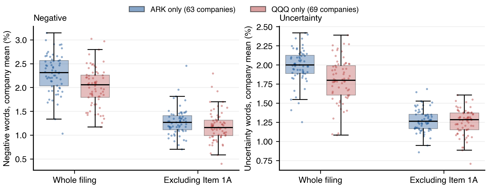
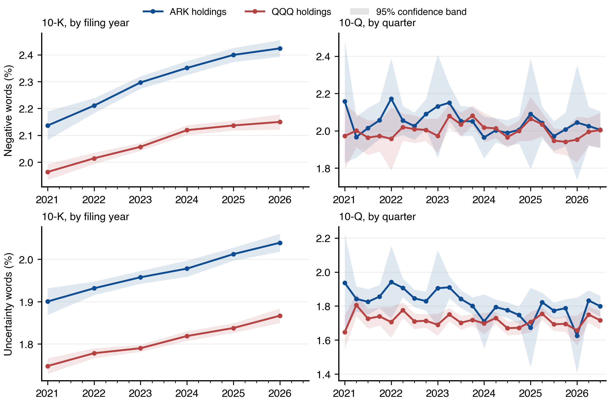

# ARK Holdings against QQQ Holdings: What the Filing-Language Comparison Shows

Companion note to the report on uncertainty and sentiment in the filings of ARK ETF holdings. Same data, measures and specifications; 10-K and 10-Q filings of January 2021 to September 2026.

## The question and the design

Do the companies ARK holds write their filings differently from the companies in QQQ, the Invesco Nasdaq-100 ETF, and does any difference carry information? The same pipeline scores every original 10-K and 10-Q of the 93 ARK holdings (1,805 filings) and the 94 QQQ holdings (2,036 filings) that file with the SEC; 22 companies are in both portfolios. Each portfolio's own results include those 22. Each difference between the portfolios is one regression on the 71 companies held only by ARK and the 72 held only by QQQ, so that no filing sits on both sides, with the coefficient on a QQQ indicator (levels), on its interaction with time (trends) or with the tone measure (market outcomes). A significant result in one portfolio next to an insignificant one in the other is never read as a difference. Every difference is estimated twice on identical filings: on the whole filing, and on the filing excluding Item 1A, the risk-factor section, because a word-share measure moves when a company prints more or fewer risk factors even if it writes the same way.

## Levels: ARK reads more negative and more uncertain, and the gap is disclosure length

On the whole filing, QQQ annual reports carry 0.27 pp fewer negative words and 0.20 pp fewer uncertainty words than ARK annual reports, both well inside 5%. Item 1A takes 30% of a QQQ annual report's words against 35% of an ARK one. Remove that section from the same filings and the gaps are 0.051 pp (p = 0.383) and 0.008 pp (p = 0.786). Figure 1 shows the company-level distributions: the boxes separate on the whole filing and sit on top of each other without Item 1A. The difference between the two portfolios is how much risk disclosure their companies print, not how they write the rest of the document.

### Table 1. Levels in annual reports

*ARK and QQQ columns: means over each portfolio's annual reports in the text sample. Difference columns: one regression per cell on the 682 annual reports with a located Item 1A of the companies held by only one portfolio, calendar-quarter and seasonal effects, two-way clustered inference; p-values in brackets.*

| Measure, annual reports                 | ARK holdings   | QQQ holdings   | QQQ less ARK, whole filing (pp)   | QQQ less ARK, excluding Item 1A (pp)   |
|:----------------------------------------|:---------------|:---------------|:----------------------------------|:---------------------------------------|
| Negative words (% of words)             | 2.31           | 2.07           | -0.273 (0.003)                    | -0.051 (0.383)                         |
| Uncertainty words (% of words)          | 1.97           | 1.81           | -0.201 (< 0.001)                  | -0.008 (0.786)                         |
| Item 1A share of the filing's words (%) | 35.5           | 30.2           | -8.0 (0.006)                      |                                        |

*Figure 1. Company-mean word shares in annual reports with a located Item 1A, companies held only by ARK against companies held only by QQQ, whole filing and excluding Item 1A. Boxes span the interquartile range, whiskers the 5th to 95th percentile, dots are companies.*

## Trends: both rise; one difference survives the correction

Negative and uncertainty language rises within company in both portfolios, on the whole filing and outside Item 1A, all at p < 0.001. ARK's slopes are steeper. On the whole filing the uncertainty difference is significant (0.007 pp a year, p = 0.001) and the negative one is not (p = 0.222); outside Item 1A it is the other way round: ARK's negative tone rises 0.034 pp a year faster (p = 0.002) and the uncertainty difference is 0.007 pp (p = 0.276). That faster rise in negative words outside the risk section is the one difference between the portfolios that does not go away when Item 1A is removed. Figure 2 shows the series.

### Table 2. Within-company trends in annual reports, 2021 to 2026

*Portfolio columns: within-company slopes with company and seasonal effects on each portfolio's annual reports with a located Item 1A. Difference columns: interaction of a QQQ indicator with elapsed years, one regression on the disjoint sample. * Company-clustered inference where the two-way clustered covariance was not positive definite.*

| Measure, annual reports      | ARK, whole filing   | QQQ, whole filing   | QQQ less ARK, whole filing   | ARK, excl. Item 1A   | QQQ, excl. Item 1A   | QQQ less ARK, excl. Item 1A   |
|:-----------------------------|:--------------------|:--------------------|:-----------------------------|:---------------------|:---------------------|:------------------------------|
| Negative words, pp a year    | +0.064 (< 0.001)    | +0.043 (< 0.001)    | -0.015 (0.222)               | +0.041 (< 0.001)     | +0.012 (0.031)       | -0.034 (0.002*)               |
| Uncertainty words, pp a year | +0.033 (< 0.001)    | +0.024 (< 0.001)    | -0.007 (0.001)               | +0.024 (< 0.001)     | +0.014 (< 0.001)     | -0.007 (0.276*)               |

*Figure 2. Both measures by quarter, ARK holdings and QQQ holdings (each including the shared companies), company-centred means with 95% bands; annual reports by filing year.*

## Market outcomes: the return association belongs to ARK, and to its risk section

In ARK quarterly reports a higher negative word share goes with a lower four-session excess return (-2.03 pp per standard deviation, p = 0.024); in QQQ quarterly reports it does not (+0.50 pp, p = 0.333), and the difference is significant (+2.9 pp, p = 0.007). Excluding Item 1A the ARK association is -0.41 pp (p = 0.622) and the difference -1.0 pp (p = 0.450). What the whole-filing measure picks up in ARK is which companies printed their risk factors that quarter: a restated section adds thousands of negative words, and those quarters carry lower returns than quarters in which the company refers to the annual report. That is a disclosure effect, not a tone effect, and the design cannot separate it from whatever else marks those quarters. Uncertainty and next-quarter volatility, with prior volatility controlled, do not differ between the portfolios in quarterly reports (p = 0.237, p = 0.522); in annual reports the coefficients differ on the whole filing (+10.0 pp, p = 0.002) and not excluding Item 1A (p = 0.863), the same pattern.

### Table 3. Effect per standard deviation of the word share, percentage points

*Portfolio columns: each portfolio's own regression on its filings with a located Item 1A and complete market data, company and calendar-quarter effects, size, dollar volume, prior excess return and prior volatility as controls. Difference columns: interaction of the measure with a QQQ indicator on the disjoint sample. Effects per standard deviation of the measure in the estimation sample, so the difference is not the arithmetic gap between the two portfolio columns.*

| Test                                                                                   | ARK, whole filing   | QQQ, whole filing   | QQQ less ARK, whole filing   | ARK, excluding Item 1A   | QQQ, excluding Item 1A   | QQQ less ARK, excluding Item 1A   |
|:---------------------------------------------------------------------------------------|:--------------------|:--------------------|:-----------------------------|:-------------------------|:-------------------------|:----------------------------------|
| Quarterly reports: four-session return on negative words                               | -2.03 (0.024)       | +0.50 (0.333)       | +2.91 (0.007)                | -0.41 (0.622)            | -0.73 (0.186)            | -1.03 (0.450)                     |
| Quarterly reports: next-quarter volatility on uncertainty, prior volatility controlled | +1.30 (0.300)       | -0.07 (0.922)       | -2.10 (0.237)                | +0.07 (0.951)            | -0.41 (0.496)            | -1.11 (0.522)                     |
| Annual reports: next-quarter volatility on uncertainty, prior volatility controlled    | -13.92 (0.203)      | +0.84 (0.812)       | +10.04 (0.002)               | -1.67 (0.673)            | -5.33 (0.117)            | -0.72 (0.863)                     |

## Disclosure practice: the two portfolios behave alike

### Table 4. How quarterly reports handle Item 1A

| Quarterly reports with a located Item 1A   | ARK holdings   | QQQ holdings   |
|:-------------------------------------------|:---------------|:---------------|
| Reports                                    | 1,211          | 1,398          |
| Restate the risk factors (%)               | 47             | 47             |
| Refer the reader to the annual report (%)  | 39             | 37             |
| Median Item 1A words when restated         | 27,137         | 15,144         |
| Median Item 1A words when referred         | 79             | 43             |
| Restating share, 2021 to 2026 (%)          | 55 to 45       | 52 to 42       |

About half of quarterly reports in either portfolio restate their risk factors and the rest mostly refer the reader to the annual report; both shares drift towards referring over the period. ARK companies write longer sections when they do restate (27,137 against 15,144 median words), which is the same fact as the larger Item 1A share of their annual reports.

## What to take from it

- On the raw Loughran-McDonald word shares, ARK holdings look more negative and more uncertain than QQQ holdings. That gap is the size of their risk-factor sections and nothing else; outside Item 1A the two portfolios write alike.
- Both portfolios' annual reports are becoming more negative and more uncertain every year. The one difference that survives removing Item 1A is that ARK's negative language outside the risk section rises faster.
- The negative-tone return association exists in ARK and not in QQQ, and it is a disclosure event, which companies printed their risk factors that quarter, rather than a tone signal.
- For monitoring or comparing the two portfolios, use the measures excluding Item 1A. The whole-filing measures rank companies by how much risk disclosure they print.

[Full results: Section 7 and Table 9 of the report; Appendix Tables C4 to C7 (QQQ's own exhibits), C12 and C13 (every difference test), Figures B6 and B7.](https://github.com/robynge/FRE-GY-7871A-Assignment1)
