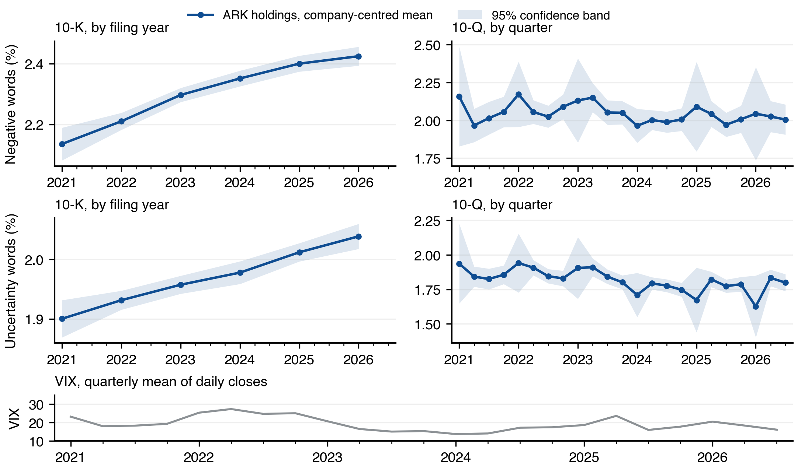
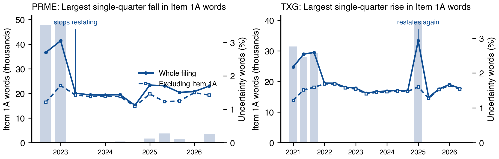

# Uncertainty and Sentiment in the Filings of ARK ETF Holdings, 2021 to 2026

FRE-GY 7871 A, Assignment 1. 1,805 10-K and 10-Q filings by 93 companies held by the six ARK ETFs on 9 September 2026, scored on the Loughran-McDonald negative and uncertainty word lists. Methods, supplementary tables and further figures are in the separate appendix.

## Summary

Negative and uncertain language in the annual reports of ARK holdings rises every year: within company, negative words gain +0.063 pp a year and uncertainty words +0.029 pp (both p < 0.001, Table 4). Quarterly reports show no trend in negative words and a small fall in the uncertainty tf.idf score. In quarterly reports that score predicts the following quarter's volatility before the prior-volatility control and weakly after it (+3.1 pp per standard deviation without the control, +2.4 pp with it, p = 0.043, Table 5). Negative tone does not predict the four-session return; in quarterly reports the test cannot detect an effect below 3.3 pp per standard deviation (Table 6). Of the quarterly reports whose risk-factor section, Item 1A, can be located, only 47% restate it; 39% refer the reader to the annual report, and that choice moves a word-share measure by itself. Excluding Item 1A cuts the annual-report trends by 27% to 36% and removes the one return association in the data (Section 6). QQQ holdings carry fewer negative and uncertainty words in their annual reports; the gap is the length of their risk sections, and outside Item 1A the two portfolios write alike except that ARK's negative tone rises faster (Section 7).

## 1. Sample

The six ARK portfolios held 121 identifiers on 9 September 2026; the assignment brief counts 124 companies from an earlier snapshot. Removing funds, cash and non-US listings, merging share classes and dropping companies that file 20-F or 40-F leaves 93 SEC filers, 22 of them also held by QQQ, the Invesco Nasdaq-100 ETF. They filed 1,805 original 10-K and 10-Q documents from January 2021 to 9 September 2026, with 0 parse failures; the 53 amendments are never scored. Table 1 lists every filter. The volatility and return samples are filtered separately because a recent filing is scored before its outcome window has elapsed. The assignment's window ends in 2025; the executed notebook and the data workbook hold the same exhibits for that window.

### Table 1. Sample filters and the filings each removed

*Panel A. From holding identifiers to SEC filers. Absence of 10-K or 10-Q filings is read from EDGAR, never inferred from domicile.*

| Filter                                | Removed   | Remaining   | Unit        |
|:--------------------------------------|:----------|:------------|:------------|
| Raw holding identifiers               | 0         | 121         | identifiers |
| Funds and non-company securities      | 3         | 118         | identifiers |
| Foreign local listings                | 5         | 113         | identifiers |
| Unresolved SEC identifiers            | 0         | 113         | identifiers |
| Merge share classes by company (CIK)  | 1         | 112         | companies   |
| Files 20-F or 40-F, not 10-K or 10-Q  | 18        | 94          | companies   |
| No 10-K, 10-Q, 20-F or 40-F on record | 1         | 93          | companies   |

*Panel B. From filings to the three analysis samples.*

| Sample     | Filter                                            | Removed   | Remaining   | Companies   |
|:-----------|:--------------------------------------------------|:----------|:------------|:------------|
| Text       | All 10-K and 10-Q filings and amendments          | 0         | 1,858       | 93          |
|            | Remove amendments and parse failures              | 53        | 1,805       | 93          |
|            | At least 2,000 words (10-K) or 1,000 (10-Q)       | 0         | 1,805       | 93          |
|            | One filing per company per quarter, the earliest  | 9         | 1,796       | 93          |
| Volatility | Filings in the text sample                        | 0         | 1,796       | 93          |
|            | Event day priced and day -1 price at least $3     | 126       | 1,670       | 93          |
|            | Outcome window complete by the market-data cutoff | 90        | 1,580       | 88          |
|            | 60 daily returns observed before and after        | 26        | 1,554       | 85          |
|            | Complete volatility windows before and after      | 0         | 1,554       | 85          |
|            | Share count on the filing's cover page            | 80        | 1,474       | 81          |
|            | Dollar volume and other controls available        | 17        | 1,457       | 81          |
| Return     | Filings in the text sample                        | 0         | 1,796       | 93          |
|            | Event day priced and day -1 price at least $3     | 126       | 1,670       | 93          |
|            | Outcome window complete by the market-data cutoff | 3         | 1,667       | 92          |
|            | 60 daily returns observed before the filing       | 30        | 1,637       | 89          |
|            | Complete four-session return window               | 0         | 1,637       | 89          |
|            | Share count on the filing's cover page            | 87        | 1,550       | 85          |
|            | Dollar volume and other controls available        | 17        | 1,533       | 85          |

## 2. Measures

The lists are the active entries of the March 2026 Loughran-McDonald Master Dictionary: 2,345 negative and 297 uncertainty words (40 on both). The brief's count of 2,355 includes ten negative words since retired. Each filing is scored on each list twice: as a share of its words, and with the tf.idf weighting of equation (1) in Loughran and McDonald (2011), fitted on the ARK corpus, under which a word present in every filing carries no weight. Word shares are in percent and differences in percentage points (pp). ARK annual reports average 2.31% negative and 1.97% uncertainty words (Table 2), against 1.39% and 1.20% for the 1994 to 2008 10-Ks of Loughran and McDonald; the two shares correlate at 0.85 across filings. Table 3 shows why the scorings differ for uncertainty: MAY is 36% of uncertainty counts and appears in 100% of filings, so it counts fully in the word share and not at all in tf.idf.

### Table 2. Summary statistics by report type

*Word shares in percent; tf.idf in score units. Annual and quarterly reports are kept apart because a 10-K is longer and heavier in risk language.*

| Form   | Measure                 | N     | Mean    | SD     | P25     | Median   | P75     |
|:-------|:------------------------|:------|:--------|:-------|:--------|:---------|:--------|
| 10-K   | Negative, word share    | 453   | 2.310   | 0.424  | 2.035   | 2.317    | 2.595   |
| 10-K   | Uncertainty, word share | 453   | 1.973   | 0.239  | 1.851   | 1.994    | 2.136   |
| 10-K   | Negative, tf.idf        | 453   | 167.616 | 55.344 | 121.893 | 158.812  | 212.474 |
| 10-K   | Uncertainty, tf.idf     | 453   | 27.240  | 8.229  | 22.017  | 26.195   | 31.982  |
| 10-Q   | Negative, word share    | 1,343 | 2.031   | 0.983  | 1.165   | 1.739    | 2.994   |
| 10-Q   | Uncertainty, word share | 1,343 | 1.820   | 0.584  | 1.326   | 1.647    | 2.412   |
| 10-Q   | Negative, tf.idf        | 1,343 | 78.975  | 68.741 | 21.977  | 47.704   | 134.370 |
| 10-Q   | Uncertainty, tf.idf     | 1,343 | 13.560  | 7.492  | 7.530   | 11.581   | 19.398  |

### Table 3. Thirty most frequent words on each list

*Share: the word's count divided by all occurrences of its own list in the ARK text sample.*

| Rank   | Negative word   | Share (%)   | Uncertainty word   | Share (%)    | Rank    | Negative word    | Share (%)     | Uncertainty word    | Share (%)      |
|:-------|:----------------|:------------|:-------------------|:-------------|:--------|:-----------------|:--------------|:--------------------|:---------------|
| 1      | LOSS            | 5.06        | MAY                | 35.76        | 16      | NEGATIVE         | 1.03          | DEPEND              | 0.93           |
| 2      | ADVERSELY       | 4.28        | COULD              | 18.48        | 17      | DELAYS           | 0.98          | VOLATILITY          | 0.91           |
| 3      | CLAIMS          | 3.08        | RISK               | 4.85         | 18      | DAMAGES          | 0.96          | UNCERTAINTY         | 0.90           |
| 4      | LOSSES          | 2.95        | RISKS              | 4.47         | 19      | RESTATED         | 0.92          | DIFFER              | 0.86           |
| 5      | ADVERSE         | 2.87        | BELIEVE            | 2.87         | 20      | DELAY            | 0.91          | ANTICIPATE          | 0.81           |
| 6      | AGAINST         | 2.52        | APPROXIMATELY      | 2.52         | 21      | DECLINE          | 0.89          | CONTINGENT          | 0.80           |
| 7      | UNABLE          | 2.02        | ASSUMPTIONS        | 1.90         | 22      | LIMITATIONS      | 0.86          | EXPOSURE            | 0.74           |
| 8      | LITIGATION      | 2.01        | INTANGIBLE         | 1.49         | 23      | CHALLENGES       | 0.78          | VARIABLE            | 0.67           |
| 9      | FAILURE         | 1.88        | POSSIBLE           | 1.31         | 24      | VOLATILITY       | 0.77          | PENDING             | 0.66           |
| 10     | HARM            | 1.75        | UNCERTAINTIES      | 1.14         | 25      | FINES            | 0.74          | DEPENDS             | 0.65           |
| 11     | FAIL            | 1.37        | MIGHT              | 1.12         | 26      | DISRUPTIONS      | 0.68          | DEPENDENT           | 0.59           |
| 12     | PENALTIES       | 1.18        | FLUCTUATIONS       | 1.07         | 27      | INVESTIGATIONS   | 0.68          | CONTINGENCIES       | 0.53           |
| 13     | DIFFICULT       | 1.18        | UNCERTAIN          | 1.02         | 28      | BREACH           | 0.67          | PROBABLE            | 0.50           |
| 14     | NEGATIVELY      | 1.17        | ANTICIPATED        | 0.99         | 29      | INFRINGEMENT     | 0.63          | VARY                | 0.48           |
| 15     | IMPAIRMENT      | 1.16        | PREDICT            | 0.94         | 30      | HARMED           | 0.62          | ASSUMED             | 0.48           |

## 3. Trends

*Figure 1. Both measures by quarter, ARK holdings, with the VIX. Lines are company-centred means (each company's score less its own mean, plus the group mean) with 95% bands; annual reports are aggregated by filing year because they cluster in the first calendar quarter. First-quarter 10-Q cells hold 6 to 9 reports, hence their wider bands.*

Annual-report tone rises every year: negative words from 2.14% in 2021 filings to 2.42% in 2026, uncertainty words from 1.90% to 2.04%. Quarterly reports show no trend in negative words; their uncertainty share falls on the aggregate test (Newey-West t = -3.71) but not within company (p = 0.112), the pattern the assignment warns of, and their uncertainty tf.idf score falls on both tests. The VIX, in the bottom strip, peaks in 2022Q2; the report offers no test of its relation to filing tone. Table 4 tests the trends two ways: a regression of the quarterly mean on time with Newey-West (four lags) standard errors, and a within-company regression with company and seasonal effects.

### Table 4. Trend tests, aggregate and within company

*Slopes per year: percentage points for word shares, score units for tf.idf. Aggregate: regression of the quarterly mean on time, 17 quarters with annual reports and 23 with quarterly reports, Newey-West standard errors. Within company: filing-level, company and seasonal effects, two-way clustered inference.*

| Report   | Measure                 | Aggregate slope   | Newey-West t   | Within-company slope   | t     | p       | Filings   |
|:---------|:------------------------|:------------------|:---------------|:-----------------------|:------|:--------|:----------|
| 10-K     | Negative, word share    | +0.061            | 9.68           | +0.063                 | 6.71  | < 0.001 | 453       |
| 10-K     | Uncertainty, word share | +0.024            | 4.48           | +0.029                 | 7.11  | < 0.001 | 453       |
| 10-K     | Negative, tf.idf        | +2.992            | 2.80           | +2.300                 | 3.32  | 0.004   | 453       |
| 10-K     | Uncertainty, tf.idf     | -0.231            | -1.23          | +0.039                 | 0.19  | 0.849   | 453       |
| 10-Q     | Negative, word share    | -0.015            | -1.77          | -0.008                 | -0.51 | 0.615   | 1,343     |
| 10-Q     | Uncertainty, word share | -0.033            | -3.71          | -0.017                 | -1.66 | 0.112   | 1,343     |
| 10-Q     | Negative, tf.idf        | -1.243            | -1.57          | -1.425                 | -1.09 | 0.288   | 1,343     |
| 10-Q     | Uncertainty, tf.idf     | -0.431            | -3.13          | -0.363                 | -2.19 | 0.040   | 1,343     |

Believed: the within-company annual-report trends. Both word shares rise at p < 0.001 (t = 6.7 and 7.1), the aggregate Newey-West test agrees (t = 9.7 for negative words against 8.9 with ordinary errors), and the tf.idf score confirms the negative trend (+2.30 score units a year, p = 0.004). Not believed as a change in how distinctively companies hedge: the uncertainty tf.idf slope is flat (p = 0.849), so the rise in uncertainty comes through words such as MAY. Section 6 shows that Item 1A lengthening accounts for 36% of the negative rise and 27% of the uncertainty rise. Quarterly reports show no trend on any scoring except a fall in the uncertainty tf.idf score (-0.36 a year, p = 0.040).

## 4. Uncertainty and post-filing volatility

### Table 5. Volatility over the following quarter on uncertainty, with and without prior volatility

*Effect: change in annualised volatility, in percentage points, per one standard deviation of the measure. Detectable: the effect this design finds with 80% power at 5%. Controls: log size, log dollar volume, prior excess return; company and calendar-quarter effects.*

| Report   | Measure                 | Prior volatility   | Filings   | Effect per SD (pp)   | Detectable (pp)   | p     |
|:---------|:------------------------|:-------------------|:----------|:---------------------|:------------------|:------|
| All      | Uncertainty, word share | No                 | 1,457     | +0.35                | 2.03              | 0.618 |
| All      | Uncertainty, word share | Yes                | 1,457     | +0.09                | 1.76              | 0.888 |
| All      | Uncertainty, tf.idf     | No                 | 1,457     | -0.02                | 3.55              | 0.988 |
| All      | Uncertainty, tf.idf     | Yes                | 1,457     | -0.30                | 3.06              | 0.778 |
| 10-K     | Uncertainty, word share | No                 | 386       | -4.92                | 12.77             | 0.270 |
| 10-K     | Uncertainty, word share | Yes                | 386       | -6.52                | 14.29             | 0.195 |
| 10-K     | Uncertainty, tf.idf     | No                 | 386       | -1.86                | 12.19             | 0.656 |
| 10-K     | Uncertainty, tf.idf     | Yes                | 386       | -1.44                | 11.79             | 0.722 |
| 10-Q     | Uncertainty, word share | No                 | 1,071     | +2.79                | 3.98              | 0.053 |
| 10-Q     | Uncertainty, word share | Yes                | 1,071     | +2.16                | 3.79              | 0.111 |
| 10-Q     | Uncertainty, tf.idf     | No                 | 1,071     | +3.15                | 3.33              | 0.012 |
| 10-Q     | Uncertainty, tf.idf     | Yes                | 1,071     | +2.42                | 3.28              | 0.043 |

The gap between the two estimates is the result. In quarterly reports the tf.idf score adds +3.15 pp of annualised volatility per standard deviation without the control (p = 0.012) and +2.42 pp with it (p = 0.043); the word share moves from +2.79 pp (p = 0.053) to +2.16 pp (p = 0.111). The control removes about a quarter of each estimate. Annual reports show nothing, with detectable effects of 12 to 14 pp. Believed weakly: 1 of the twelve estimates is significant after the control, at p = 0.043, against detectable effects of 3.3 pp; on the quarterly reports whose Item 1A is located, the word-share estimate with the control is +1.3 pp (p = 0.300) and, excluding the section, +0.1 pp (p = 0.951).

## 5. Sentiment and the filing-period return

### Table 6. Four-session excess return on negative tone, with controls

*Excess return over the S&P 500 ETF from the filing event day to day 3, in percentage points per standard deviation of the measure. Same controls as Table 5 plus prior volatility.*

| Report   | Measure              | Filings   | Effect per SD (pp)   | Detectable (pp)   | p     |
|:---------|:---------------------|:----------|:---------------------|:------------------|:------|
| All      | Negative, word share | 1,533     | -0.53                | 1.63              | 0.352 |
| All      | Negative, tf.idf     | 1,533     | -0.80                | 1.99              | 0.253 |
| 10-K     | Negative, word share | 387       | -1.64                | 8.40              | 0.570 |
| 10-K     | Negative, tf.idf     | 387       | -3.15                | 7.01              | 0.201 |
| 10-Q     | Negative, word share | 1,146     | -1.80                | 3.33              | 0.129 |
| 10-Q     | Negative, tf.idf     | 1,146     | -1.57                | 3.55              | 0.212 |

No estimate reaches 5%: the closest is -1.80 pp per standard deviation of the negative word share in quarterly reports (p = 0.129). Not believed as evidence of no effect: the test is underpowered, with a detectable effect of 3.3 pp per standard deviation in quarterly reports and 1.6 pp across all filings. Not believed as evidence of an effect either. Section 6 shows that on the quarterly reports whose Item 1A is located the whole-filing estimate is -2.03 pp (p = 0.024) and that this is a disclosure effect rather than a tone effect.

## 6. The risk-factor section

Of 1,211 ARK quarterly reports with a located Item 1A heading (90% of filings), 47% restate, 11% claim no material change but add updates, 39% refer the reader to the annual report and 3% disclose nothing. A restated section runs to a median of 27,137 words, a reference to 79; in annual reports Item 1A is 35% of all words. Item 1A is the most hedged and most negative part of a filing: in restated sections 3.3% of words are uncertainty words and 4.1% negative words, against 1.4% and 1.3% in the rest of the same filings. A word share divides list words by all words, so replacing a 27,000-word section with a 79-word reference removes far more list words than words, and the whole-filing share falls although nothing else in the filing has changed. Across 81 such quarters by 36 companies the uncertainty share falls 0.21 pp and the negative share 0.38 pp, while the share of the rest of the filing moves +0.05 and 0.00 pp. Figure 2 shows the two largest cases; Table 7 ranks the holdings on the measure excluding Item 1A; Table 8 repeats each result on the same filings without Item 1A.

*Figure 2. Item 1A words (bars) and uncertainty word share of the whole filing (solid) and excluding Item 1A (dashed, hollow squares), quarterly reports. Left: PRME (Prime Medicine, Inc.), August 2023, 49,292 to 75 words; the whole-filing share falls 1.57 pp, the share excluding Item 1A 0.28 pp. Right: TXG (10X Genomics, Inc.), May 2025, restating after three years, 52 to 39,630 words.*

### Table 7. ARK holdings ranked on uncertainty words excluding Item 1A

*Level: latest annual report with a located Item 1A, 83 companies. Trend: within-company slope over 2021 to 2026 for the 71 companies with at least three such reports; slopes rest on three to six observations and rank companies. Tickers; full lists in Appendix Figure B2 and Table C8.*

| Rank   | Most uncertain (%)   | Least uncertain (%)   | Largest rise (pp a year)   | Largest fall (pp a year)   |
|:-------|:---------------------|:----------------------|:---------------------------|:---------------------------|
| 1      | LLY  1.78            | IONS  0.85            | WGS  +0.121                | KDK  -0.105                |
| 2      | DKNG  1.76           | IRDM  0.94            | LUNR  +0.110               | TER  -0.098                |
| 3      | JOBY  1.61           | KDK  1.02             | DASH  +0.101               | META  -0.057               |
| 4      | PACB  1.60           | CRWV  1.05            | MASS  +0.092               | TWST  -0.032               |
| 5      | NTRA  1.57           | P  1.11               | BMNR  +0.074               | CNTN  -0.025               |

### Table 8. The same results on the whole filing and excluding Item 1A, identical filings

*Within-company trends and outcome regressions as in Tables 4 to 6, on the filings whose Item 1A heading was located. Word-share measures only.*

| Result                                                                          | Filings   | Whole filing   | p       | Excluding Item 1A   | p       |
|:--------------------------------------------------------------------------------|:----------|:---------------|:--------|:--------------------|:--------|
| Annual reports: negative words, trend (pp a year)                               | 404       | +0.064         | < 0.001 | +0.041              | < 0.001 |
| Annual reports: uncertainty words, trend (pp a year)                            | 404       | +0.033         | < 0.001 | +0.024              | < 0.001 |
| Quarterly reports: negative words, trend (pp a year)                            | 1,211     | -0.010         | 0.553   | +0.028              | 0.013   |
| Quarterly reports: uncertainty words, trend (pp a year)                         | 1,211     | -0.016         | 0.183   | +0.009              | 0.145   |
| Quarterly reports: volatility on uncertainty, with prior volatility (pp per SD) | 962       | +1.299         | 0.300   | +0.067              | 0.951   |
| Quarterly reports: four-session return on negative words (pp per SD)            | 1,029     | -2.027         | 0.024   | -0.410              | 0.622   |

Believed: the whole-filing measures record how much risk disclosure a company prints as much as how it writes. Item 1A's share of the annual report grows +0.43 pp a year, and removing the section cuts the annual-report trends to +0.041 pp and +0.024 pp, still at p < 0.001. In quarterly reports the section shrinks (-1.21 pp a year, p = 0.036) as more companies stop restating, and the negative share of the rest of the filing rises +0.028 pp a year (p = 0.013) while the whole-filing measure is flat. The return association on the whole filing (-2.03 pp, p = 0.024) disappears excluding the section (-0.41 pp, p = 0.622): a company that prints its risk factors prints thousands of negative words and earns a lower return that quarter than one that refers to the annual report; the design cannot separate that from whatever else marks those quarters. Uncertainty is highest at LLY, DKNG, JOBY and lowest at IONS, IRDM, KDK; it rises fastest at WGS, LUNR, DASH and falls fastest at KDK, TER, META (Table 7).

## 7. Comparison with QQQ holdings

The same pipeline was run on the 94 SEC filers among the QQQ (Nasdaq-100) constituents of 9 September 2026, 2,036 filings, 22 of the companies being in both portfolios (Appendix Tables C4 to C7). QQQ annual reports average 2.07% negative and 1.81% uncertainty words against ARK's 2.31% and 1.97% (Table 2), and they trend upward within company at +0.041 pp and +0.024 pp a year (both p < 0.001), as ARK's do. No QQQ volatility or return estimate reaches 5% (smallest p = 0.055). Of quarterly reports with a located Item 1A, 47% restate risk factors and 37% refer to the annual report. Table 9 tests each difference in one regression on the companies held by only one portfolio, whole filing and excluding Item 1A on identical filings; Appendix Figure B7 shows the company-level distributions behind the level rows.

### Table 9. QQQ holdings less ARK holdings

*Coefficient on a QQQ indicator (levels), on its interaction with time (trends) or with the measure (outcomes) in one regression on the companies held by only one portfolio. Level differences with calendar-quarter effects; outcome differences with the controls of Tables 5 and 6 and company effects. Filings whose Item 1A heading was located. * Company-clustered inference; the two-way clustered covariance was not positive definite.*

| Result                                                                          | Filings   | Whole filing   | p       | Excluding Item 1A   | p      |
|:--------------------------------------------------------------------------------|:----------|:---------------|:--------|:--------------------|:-------|
| Annual reports: negative words, level (pp)                                      | 682       | -0.273         | 0.003   | -0.051              | 0.383  |
| Annual reports: uncertainty words, level (pp)                                   | 682       | -0.201         | < 0.001 | -0.008              | 0.786  |
| Annual reports: negative words, trend (pp a year)                               | 682       | -0.015         | 0.222   | -0.034              | 0.002* |
| Annual reports: uncertainty words, trend (pp a year)                            | 682       | -0.007         | 0.001   | -0.007              | 0.276* |
| Quarterly reports: four-session return on negative words (pp per SD)            | 1,829     | +2.906         | 0.007   | -1.033              | 0.450  |
| Quarterly reports: volatility on uncertainty, with prior volatility (pp per SD) | 1,725     | -2.100         | 0.237   | -1.112              | 0.522  |
| Annual reports: volatility on uncertainty, with prior volatility (pp per SD)    | 627       | +10.043        | 0.002   | -0.725              | 0.863  |

Believed: on the raw scores ARK holdings read more negative and more uncertain than QQQ holdings, and the whole of that gap is how much risk-factor text they print. QQQ annual reports carry 0.27 pp fewer negative and 0.20 pp fewer uncertainty words on the whole filing (p = 0.003, p < 0.001); Item 1A takes 30% of their words against 35% of ARK's (difference 8.0 pp, p = 0.006); excluding the section the gaps are 0.051 pp (p = 0.383) and 0.008 pp (p = 0.786), and the two distributions in Figure B7 overlap. The negative-tone return association of Section 6 belongs to ARK alone: QQQ shows none, the difference is significant on the whole filing (+2.9 pp per standard deviation, p = 0.007) and gone excluding Item 1A (-1.0 pp, p = 0.450), a disclosure effect rather than a tone effect. The volatility coefficients do not differ in quarterly reports (p = 0.237, p = 0.522); in annual reports they differ on the whole filing (+10.0 pp per standard deviation, p = 0.002) and not excluding Item 1A (p = 0.863). One difference survives the correction: ARK's negative tone outside Item 1A rises faster, by 0.034 pp a year (p = 0.002); its uncertainty trend is steeper only on the whole filing (0.007 pp a year, p = 0.001). Compared on the measure excluding Item 1A, the two portfolios differ in that one trend and in nothing else.

[Loughran, T., and B. McDonald, 2011, When is a liability not a liability? Textual analysis, dictionaries, and 10-Ks, Journal of Finance 66, 35-65. Code, executed notebook, tests and the data workbook: github.com/robynge/FRE-GY-7871A-Assignment1](https://github.com/robynge/FRE-GY-7871A-Assignment1)
