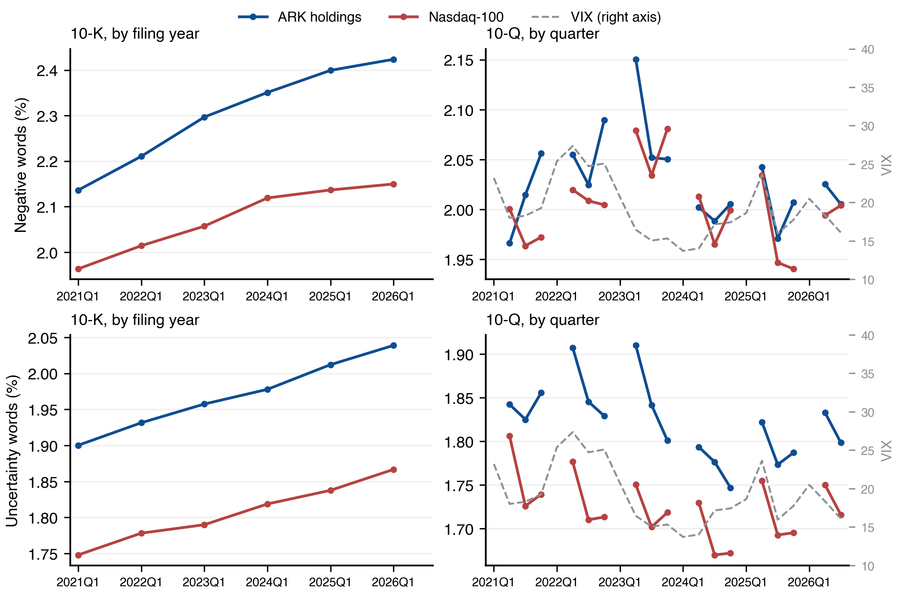
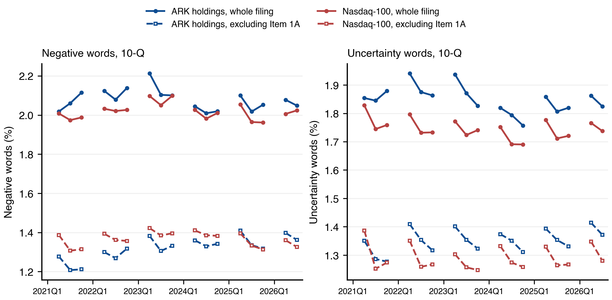
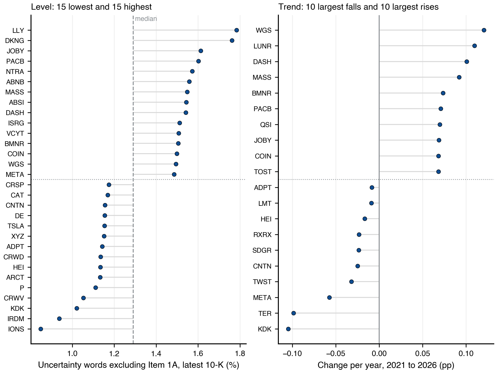
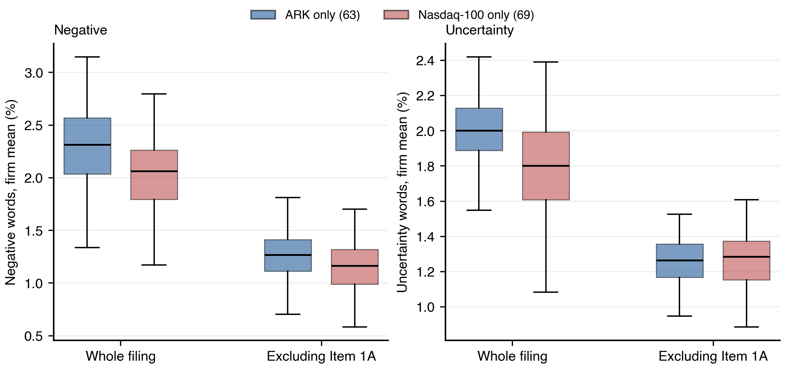
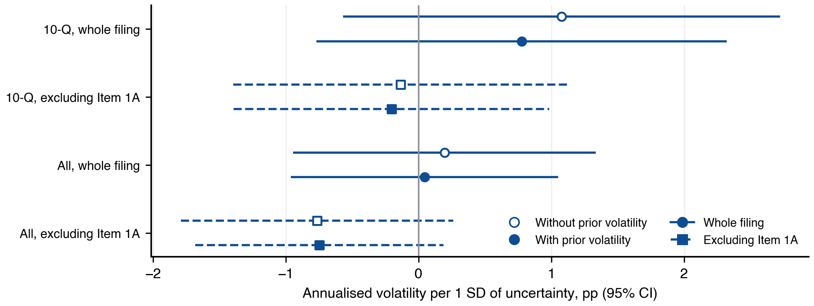
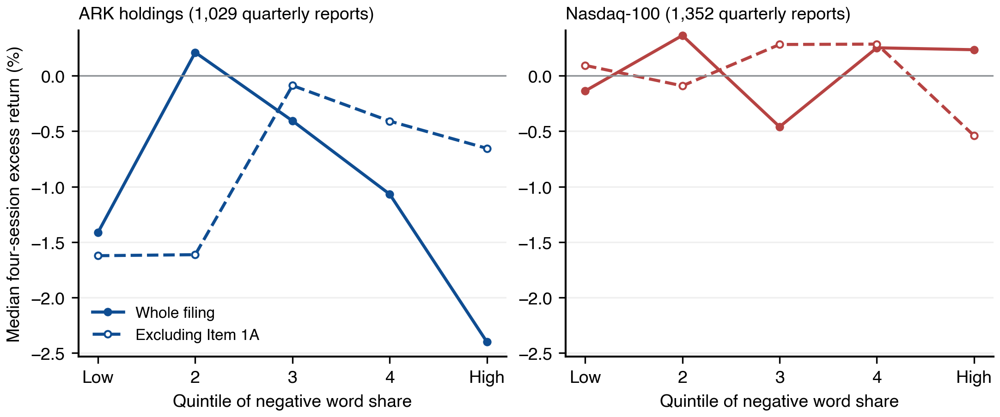
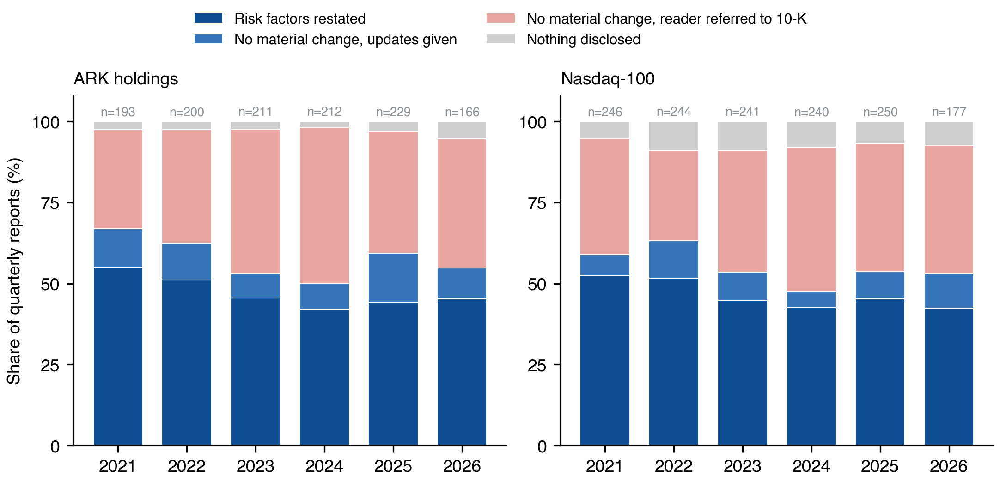
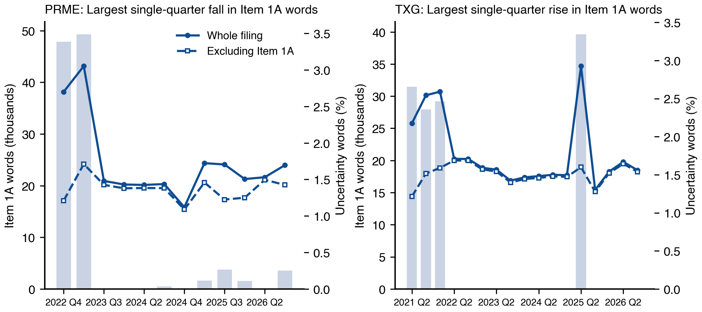

# Filing Tone and Risk-Factor Disclosure: ARK Holdings and the Nasdaq-100, 2021 to 2026

Negative and uncertain language in 3,413 10-K and 10-Q filings by 165 companies, January 2021 to September 2026. FRE-GY 7871 A, Assignment 1, extended.

## Executive Summary

This report scores 3,413 annual and quarterly reports filed between January 2021 and September 2026 by 165 companies that are held by the six ARK ETFs or included in the Nasdaq-100. Each filing is scored on the Loughran and McDonald (2011) negative and uncertainty word lists, both as a share of the filing's words and with the term-frequency weighting of equation (1) in that paper, referred to below as tf.idf. Differences and changes in word shares are reported in percentage points (pp). The tests are those set by the assignment: trends within company, post-filing volatility with and without a prior-volatility control, and the four-session return around the filing. Each test is run on the whole filing and again on the filing excluding Item 1A, the risk-factor section.

On the whole filing, annual-report tone rises in both groups: negative words gain +0.051 pp a year within company and uncertainty words +0.026 pp, both at p < 0.001. ARK annual reports carry 0.29 pp more negative and 0.23 pp more uncertain language than Nasdaq-100 constituents. Uncertainty does not predict the following quarter's volatility once prior volatility is controlled. Negative tone is associated with a lower four-session return in ARK quarterly reports on the filings whose Item 1A could be located (-2.0 pp per standard deviation, p = 0.024); on all ARK quarterly reports the estimate is -1.8 pp (p = 0.129), and the index shows no association.

Only 45% of the quarterly reports with a located Item 1A restate their risk factors. 39% state that nothing material has changed and refer the reader to the annual report, printing a median of 63 words where a restatement runs to 19,487. Because both measures are word shares, that choice moves them mechanically. Excluding Item 1A cuts the annual-report trends by 39% to 52%, and they remain significant. It closes the gap between ARK and the index (0.008 pp for uncertainty, p = 0.786) and removes the return association in ARK (-0.4 pp, p = 0.622). The volatility result does not change. On the whole filing, the measures record how much risk disclosure a company prints as much as how it writes.

## 1. Introduction

Loughran and McDonald (2011) showed that a negative word list built from the language of 10-K filings predicts the market reaction to those filings, while the general-purpose Harvard psychology list does not: almost three-quarters of the Harvard list's negative counts in 10-Ks are words with no negative meaning in a financial statement. Their finance-specific lists have since become the standard tool for measuring tone in filings.

This report applies two of those lists to the current holdings of the six ARK ETFs and to the constituents of the Nasdaq-100. The negative list measures how bad the news is. The uncertainty list measures how far management declines to commit: a sentence stating that results may fluctuate for reasons outside the company's control carries no bad news at all. The two are kept apart throughout and tested against different outcomes, negative tone against the return around the filing and uncertainty against subsequent volatility.

Four questions organise the results: whether filing tone is trending, whether ARK holdings differ from the index, whether uncertainty predicts volatility, and whether negative tone predicts the filing-period return. Each is answered twice, once on the whole filing as in Loughran and McDonald and once on the filing excluding Item 1A. The second answer is needed because 55% of quarterly reports with a located Item 1A do not restate their risk factors and a word-share measure cannot tell that choice apart from a change in tone. Loughran and McDonald met the same problem with the MD&A section, which more than half of firms incorporated by reference in 1994, and excluded those filings (pp. 40, 54). This report decomposes the effect instead of excluding the filings. Sections 2 to 7 give the data, the four results, the mechanism and the conclusions; Appendix A holds every specification and Appendix B the supplementary tables.

## 2. Data and Measures

### Sample

The universe is 223 holding identifiers as at 9 September 2026: 121 from the six ARK ETF portfolios and 102 Nasdaq-100 constituents. The assignment brief counts 124 ARK companies from an earlier snapshot of the same portfolios. The sample removes funds, cash and non-US local listings, merges share classes by SEC company identifier (CIK), and records companies that report on Form 20-F or 40-F rather than 10-K and 10-Q from their EDGAR filing history. 165 SEC filers remain: 71 held by ARK only, 22 held by ARK and in the index, 72 in the index only. Every original 10-K and 10-Q they filed from January 2021 was downloaded and parsed, 3,413 documents with 0 parse failures; the 60 amendments are recorded and never scored. Table 1 shows what each filter removed. Tables 1 to 6 keep the numbering the assignment specifies; Tables 7 and 8 are additional.

### Table 1. Sample construction

*Panel A. From holding identifiers to SEC filers. Absence of 10-K or 10-Q filings is recorded from observed EDGAR behaviour, never inferred from a company's domicile.*

| Filter                                          | Removed   | Remaining   | Unit        |
|:------------------------------------------------|:----------|:------------|:------------|
| Raw holding identifiers                         | 0         | 223         | identifiers |
| Funds and non-company securities                | 3         | 220         | identifiers |
| Foreign local listings                          | 5         | 215         | identifiers |
| Unresolved SEC identifiers                      | 0         | 215         | identifiers |
| Merge share classes and companies on both lists | 24        | 191         | companies   |
| Files 20-F or 40-F, not 10-K or 10-Q            | 25        | 166         | companies   |
| No 10-K, 10-Q, 20-F or 40-F on record           | 1         | 165         | companies   |

*Panel B. From filings to analysis samples. The text sample supports Tables 2 to 4. The volatility and return samples support Tables 5 and 6 and are filtered separately, because a filing can be scored before its outcome window has elapsed.*

| Sample   | Filter                                           | Removed   | Remaining   | Companies   |
|:---------|:-------------------------------------------------|:----------|:------------|:------------|
| Text     | All 10-K and 10-Q filings and amendments         | 0         | 3,473       | 165         |
|          | Remove amendments and parse failures             | 60        | 3,413       | 165         |
|          | At least 2,000 words (10-K) or 1,000 (10-Q)      | 0         | 3,413       | 165         |
|          | One filing per company per quarter, the earliest | 33        | 3,380       | 165         |

| Sample     | Filter                                            | Removed   | Remaining   | Companies   |
|:-----------|:--------------------------------------------------|:----------|:------------|:------------|
| Volatility | Filings in the text sample                        | 0         | 3,380       | 165         |
|            | Event day priced and day -1 price at least $3     | 126       | 3,254       | 165         |
|            | Outcome window complete by the market-data cutoff | 158       | 3,096       | 160         |
|            | 60 daily returns observed before and after        | 31        | 3,065       | 157         |
|            | Complete volatility windows before and after      | 0         | 3,065       | 157         |
|            | Share count on the filing's cover page            | 80        | 2,985       | 153         |
|            | Dollar volume and other controls available        | 17        | 2,968       | 153         |

| Sample   | Filter                                            | Removed   | Remaining   | Companies   |
|:---------|:--------------------------------------------------|:----------|:------------|:------------|
| Return   | Filings in the text sample                        | 0         | 3,380       | 165         |
|          | Event day priced and day -1 price at least $3     | 126       | 3,254       | 165         |
|          | Outcome window complete by the market-data cutoff | 4         | 3,250       | 164         |
|          | 60 daily returns observed before the filing       | 35        | 3,215       | 161         |
|          | Complete four-session return window               | 0         | 3,215       | 161         |
|          | Share count on the filing's cover page            | 87        | 3,128       | 157         |
|          | Dollar volume and other controls available        | 17        | 3,111       | 157         |

### Measures

The word lists are the active entries in the March 2026 release of the Loughran-McDonald Master Dictionary: 2,345 negative and 297 uncertainty words, 40 on both. The 2011 paper used 2,337 and 285; the assignment brief cites 2,355 negative words, a count that includes entries since retired from the list. Each filing is scored twice on each list. The word share divides list-word occurrences by all words retained from the filing. The tf.idf score weights each occurrence by its log frequency, normalised by the filing's average word frequency, and by the log inverse document frequency across the corpus, so a word that appears in every filing receives no weight. Appendix A gives the formula and the parsing rules.

Table 2 gives the level and spread of the four measures by group and report type, which the trend and difference tests take as their baseline, and the characteristics of the risk-factor section that the rest of the report turns on.

### Table 2. Summary statistics

*Panel A. Tone measures by group and report type. Word shares in percent; tf.idf scores in score units, fitted on the pooled corpus. ARK holdings and Nasdaq-100 each include the 22 companies in both. Annual and quarterly reports are kept separate because a 10-K is longer and carries more risk language.*

| Group        | Form   | Measure                 | N     | Mean    | SD     | P25     | Median   | P75     |
|:-------------|:-------|:------------------------|:------|:--------|:-------|:--------|:---------|:--------|
| ARK holdings | 10-K   | Negative, word share    | 453   | 2.310   | 0.424  | 2.035   | 2.317    | 2.595   |
| ARK holdings | 10-K   | Uncertainty, word share | 453   | 1.973   | 0.239  | 1.851   | 1.994    | 2.136   |
| ARK holdings | 10-K   | Negative, tf.idf        | 453   | 183.550 | 62.841 | 131.011 | 173.500  | 233.436 |
| ARK holdings | 10-K   | Uncertainty, tf.idf     | 453   | 29.321  | 9.065  | 23.385  | 28.150   | 34.394  |
| ARK holdings | 10-Q   | Negative, word share    | 1,343 | 2.031   | 0.983  | 1.165   | 1.739    | 2.994   |
| ARK holdings | 10-Q   | Uncertainty, word share | 1,343 | 1.820   | 0.584  | 1.326   | 1.647    | 2.412   |
| ARK holdings | 10-Q   | Negative, tf.idf        | 1,343 | 86.782  | 76.426 | 24.084  | 51.497   | 148.314 |
| ARK holdings | 10-Q   | Uncertainty, tf.idf     | 1,343 | 14.643  | 8.242  | 7.967   | 12.441   | 20.962  |
| Nasdaq-100   | 10-K   | Negative, word share    | 518   | 2.073   | 0.438  | 1.790   | 2.065    | 2.373   |
| Nasdaq-100   | 10-K   | Uncertainty, word share | 518   | 1.806   | 0.292  | 1.623   | 1.824    | 2.019   |
| Nasdaq-100   | 10-K   | Negative, tf.idf        | 518   | 134.534 | 46.399 | 101.918 | 128.384  | 158.097 |
| Nasdaq-100   | 10-K   | Uncertainty, tf.idf     | 518   | 23.937  | 6.902  | 18.918  | 23.632   | 28.281  |
| Nasdaq-100   | 10-Q   | Negative, word share    | 1,494 | 2.003   | 0.884  | 1.208   | 1.825    | 2.759   |
| Nasdaq-100   | 10-Q   | Uncertainty, word share | 1,494 | 1.722   | 0.594  | 1.239   | 1.540    | 2.238   |
| Nasdaq-100   | 10-Q   | Negative, tf.idf        | 1,494 | 70.177  | 53.637 | 23.329  | 50.192   | 111.227 |
| Nasdaq-100   | 10-Q   | Uncertainty, tf.idf     | 1,494 | 12.481  | 6.575  | 6.840   | 11.117   | 17.144  |

*Panel B. The risk-factor section. Quarterly-report statistics use filings with a located Item 1A heading; the disclosure modes are defined in Appendix A.*

| Statistic                                           | Value   |
|:----------------------------------------------------|:--------|
| Quarterly reports with a located Item 1A            | 2,290   |
| Share restating risk factors (%)                    | 45.2    |
| Share claiming no material change, with updates (%) | 9.2     |
| Share referring the reader to the annual report (%) | 39.4    |
| Share disclosing nothing (%)                        | 6.2     |
| Median Item 1A words, restated                      | 19,487  |
| Median Item 1A words, referred                      | 63      |
| Uncertainty words inside Item 1A, restated (%)      | 3.32    |
| Uncertainty words inside Item 1A, referred (%)      | 6.31    |
| Item 1A share of 10-K words, ARK holdings (%)       | 35.5    |
| Item 1A share of 10-K words, Nasdaq-100 (%)         | 30.2    |
| Correlation of negative and uncertainty word shares | 0.83    |
| Filings with a located Item 1A heading (%)          | 90.9    |

ARK annual reports average 2.31% negative and 1.97% uncertain words, Nasdaq-100 annual reports 2.07% and 1.81%. Loughran and McDonald report 1.39% and 1.20% for 50,115 10-Ks filed 1994 to 2008, with the negative share rising from about 1.1% to 1.7% over their period. The levels here continue that rise. The two measures correlate at 0.83 across filings, so they are related measures rather than independent evidence.

Table 3 lists the thirty most frequent words on each list. It shows why the two scorings can disagree on uncertainty and agree on negative tone.

### Table 3. Thirty most frequent words on each list

*Each share divides a word's count by all occurrences in its own list across the pooled text sample. The two lists are counted separately.*

| Rank   | Negative word   | Share of negative count (%)   | Uncertainty word   | Share of uncertainty count (%)   |
|:-------|:----------------|:------------------------------|:-------------------|:---------------------------------|
| 1      | LOSS            | 5.28                          | MAY                | 33.26                            |
| 2      | ADVERSELY       | 4.26                          | COULD              | 17.64                            |
| 3      | LOSSES          | 3.48                          | RISK               | 5.52                             |
| 4      | CLAIMS          | 3.02                          | RISKS              | 5.00                             |
| 5      | ADVERSE         | 2.89                          | APPROXIMATELY      | 3.09                             |
| 6      | AGAINST         | 2.46                          | BELIEVE            | 2.83                             |
| 7      | LITIGATION      | 2.08                          | ASSUMPTIONS        | 1.99                             |
| 8      | UNABLE          | 1.85                          | INTANGIBLE         | 1.85                             |
| 9      | FAILURE         | 1.81                          | POSSIBLE           | 1.28                             |
| 10     | IMPAIRMENT      | 1.68                          | FLUCTUATIONS       | 1.24                             |
| 11     | HARM            | 1.62                          | UNCERTAINTIES      | 1.14                             |
| 12     | NEGATIVELY      | 1.28                          | ANTICIPATED        | 1.07                             |
| 13     | FAIL            | 1.16                          | UNCERTAIN          | 1.02                             |
| 14     | PENALTIES       | 1.13                          | VOLATILITY         | 1.00                             |
| 15     | DIFFICULT       | 1.06                          | EXPOSURE           | 0.97                             |
| 16     | NEGATIVE        | 1.01                          | PREDICT            | 0.94                             |
| 17     | DELAYS          | 0.94                          | UNCERTAINTY        | 0.90                             |
| 18     | DECLINE         | 0.92                          | DEPEND             | 0.90                             |
| 19     | RESTATED        | 0.92                          | DIFFER             | 0.88                             |
| 20     | DAMAGES         | 0.91                          | MIGHT              | 0.86                             |
| 21     | VOLATILITY      | 0.85                          | CONTINGENT         | 0.79                             |
| 22     | LIMITATIONS     | 0.82                          | VARIABLE           | 0.79                             |
| 23     | DELAY           | 0.81                          | ANTICIPATE         | 0.77                             |
| 24     | CHALLENGES      | 0.78                          | PENDING            | 0.75                             |
| 25     | DISRUPTIONS     | 0.78                          | CONTINGENCIES      | 0.69                             |
| 26     | RESTRUCTURING   | 0.67                          | DEPENDS            | 0.66                             |
| 27     | FINES           | 0.66                          | DEPENDENT          | 0.60                             |
| 28     | INVESTIGATIONS  | 0.65                          | ASSUMED            | 0.56                             |
| 29     | INFRINGEMENT    | 0.61                          | PROBABLE           | 0.56                             |
| 30     | BREACH          | 0.61                          | VARY               | 0.52                             |

The ten most frequent uncertainty words account for 74% of uncertainty counts, against 29% for negative words. MAY alone is 33.3% of uncertainty counts and appears in 100% of filings; APPROXIMATELY appears in 98%. A word present in every document has an inverse document frequency of zero, so MAY counts fully in the word share and not at all in the tf.idf score. The uncertainty list is dominated by such words and the negative list is not, which is why the two scorings diverge on the uncertainty trend in Section 3.

### The risk-factor section

Each filing is also split at its Item 1A heading into the risk-factor section and the balance of the document. The heading is located in 90.9% of filings, 90% for ARK holdings and 93% for the index, both including the shared companies; filers who label the section differently are recorded as not located and excluded from the split rather than guessed at. Among quarterly reports with a located heading, 45% restate the risk factors, 9% claim no material change but add updates, 39% refer the reader to the annual report, and 6% disclose nothing (Table 2, Panel B). Every test that follows is reported on the whole filing and on the filing excluding Item 1A, on identical filings.

### Market data

Day 0 is the first NYSE session on or after EDGAR accepts the filing. The filing-period return is the four-session buy-and-hold return from day 0, less the return on the S&P 500 ETF (SPY), following the window of Loughran and McDonald. Post-filing volatility covers trading days 4 to 63 and prior volatility days -60 to -6. Appendix A defines the windows, the size and liquidity controls and the price filter.

## 3. Tone Trends, 2021 to 2026

### 3.1 The series

Figure 1 plots the two word shares by quarter for both groups and both report types, with the VIX for comparison as the assignment asks. It sets out what the trend tests in Table 4 then formalise.

*Figure 1. Tone by group and report type. Lines are company-centred means: each company's score less its own mean, plus the group mean, so entry and exit of companies do not move the line. Annual reports are aggregated by filing year and plotted at the first quarter, where most are filed. Quarterly-report cells with fewer than 30 filings are blank, which removes every first calendar quarter: calendar-year companies file their 10-K then, leaving 6 to 25 quarterly reports. The VIX is the quarterly mean of daily closes.*

Annual-report tone rises in both groups every year without a reversal. ARK negative words rise from 2.14% in 2021 filings to 2.42% in 2026, Nasdaq-100 from 1.96% to 2.15%. Uncertainty rises from 1.90% to 2.04% and from 1.75% to 1.87%. The negative-word gap between the groups widens from 0.17 pp in 2021 to 0.27 pp in 2026; the uncertainty gap moves from 0.15 to 0.17 pp. Quarterly reports show no drift on either measure. Their relation to the VIX is loose: the VIX peaks in 2022Q2 and ARK negative words in 2023Q2, and both run lower through 2024 and 2025. The report offers no formal test of that association.

### 3.2 Trend tests

Table 4 estimates the trend two ways. The aggregate model regresses the quarterly mean on elapsed years with seasonal indicators. The within-company model uses filing-level observations with company effects and seasonal indicators. A series of 23 quarterly means is short and serially correlated, so the aggregate model reports Newey-West t-statistics: for quarterly-report uncertainty the ordinary t-statistic is -4.02 and the Newey-West -3.98. The within-company estimate is the one read for inference, because company effects remove differences in baseline tone that a quarterly mean carries whenever the mix of companies changes. Panel B repeats the within-company model on the filing excluding Item 1A, on the same filings as the whole-filing column.

### Table 4. Trend tests

*Panel A. Pooled sample, whole filing. Slopes are per year: percentage points for word shares, score units for tf.idf. Inference is described in Appendix A.*

| Report   | Measure                 | Aggregate slope   | Newey-West t   | Within-company slope   | t     | p       | Filings   |
|:---------|:------------------------|:------------------|:---------------|:-----------------------|:------|:--------|:----------|
| All      | Negative, word share    | +0.011            | 2.12           | +0.008                 | 0.85  | 0.405   | 3,380     |
| All      | Uncertainty, word share | +0.001            | 0.24           | -0.002                 | -0.40 | 0.692   | 3,380     |
| All      | Negative, tf.idf        | +0.971            | 1.64           | +0.047                 | 0.07  | 0.947   | 3,380     |
| All      | Uncertainty, tf.idf     | -0.193            | -1.43          | -0.305                 | -2.80 | 0.011   | 3,380     |
| 10-K     | Negative, word share    | +0.054            | 11.75          | +0.051                 | 8.67  | < 0.001 | 862       |
| 10-K     | Uncertainty, word share | +0.028            | 4.77           | +0.026                 | 10.52 | < 0.001 | 862       |
| 10-K     | Negative, tf.idf        | +2.315            | 3.46           | +1.776                 | 3.89  | < 0.001 | 862       |
| 10-K     | Uncertainty, tf.idf     | -0.249            | -1.69          | -0.082                 | -0.57 | 0.572   | 862       |
| 10-Q     | Negative, word share    | -0.011            | -2.27          | -0.006                 | -0.54 | 0.592   | 2,518     |
| 10-Q     | Uncertainty, word share | -0.016            | -3.98          | -0.012                 | -1.65 | 0.113   | 2,518     |
| 10-Q     | Negative, tf.idf        | -0.898            | -2.01          | -1.322                 | -1.42 | 0.169   | 2,518     |
| 10-Q     | Uncertainty, tf.idf     | -0.428            | -3.81          | -0.446                 | -3.50 | 0.002   | 2,518     |

*Panel B. Within-company slopes, whole filing and excluding Item 1A, on identical filings (those with a located Item 1A), per year in percentage points. The last row of each block is the trend in Item 1A's share of the filing's words. ARK holdings and Nasdaq-100 each include the shared companies.*

| Group        | Form   | Measure                 | Whole filing   | p       | Excluding Item 1A   | p       | Filings   |
|:-------------|:-------|:------------------------|:---------------|:--------|:--------------------|:--------|:----------|
| Pooled       | 10-K   | Negative, word share    | +0.052         | < 0.001 | +0.025              | < 0.001 | 784       |
| Pooled       | 10-K   | Uncertainty, word share | +0.028         | < 0.001 | +0.017              | < 0.001 | 784       |
| Pooled       | 10-K   | Item 1A share of words  | +0.524         | < 0.001 |                     |         | 784       |
| Pooled       | 10-Q   | Negative, word share    | -0.007         | 0.601   | +0.009              | 0.326   | 2,290     |
| Pooled       | 10-Q   | Uncertainty, word share | -0.012         | 0.164   | +0.002              | 0.748   | 2,290     |
| Pooled       | 10-Q   | Item 1A share of words  | -0.597         | 0.160   |                     |         | 2,290     |
| ARK holdings | 10-K   | Negative, word share    | +0.064         | < 0.001 | +0.041              | < 0.001 | 404       |
| ARK holdings | 10-K   | Uncertainty, word share | +0.033         | < 0.001 | +0.024              | < 0.001 | 404       |
| ARK holdings | 10-K   | Item 1A share of words  | +0.426         | 0.038   |                     |         | 404       |
| ARK holdings | 10-Q   | Negative, word share    | -0.010         | 0.553   | +0.028              | 0.013   | 1,211     |
| ARK holdings | 10-Q   | Uncertainty, word share | -0.016         | 0.183   | +0.009              | 0.145   | 1,211     |
| ARK holdings | 10-Q   | Item 1A share of words  | -1.214         | 0.036   |                     |         | 1,211     |
| Nasdaq-100   | 10-K   | Negative, word share    | +0.043         | < 0.001 | +0.012              | 0.031   | 482       |
| Nasdaq-100   | 10-K   | Uncertainty, word share | +0.024         | < 0.001 | +0.014              | < 0.001 | 482       |
| Nasdaq-100   | 10-K   | Item 1A share of words  | +0.582         | < 0.001 |                     |         | 482       |
| Nasdaq-100   | 10-Q   | Negative, word share    | -0.001         | 0.975   | -0.006              | 0.622   | 1,398     |
| Nasdaq-100   | 10-Q   | Uncertainty, word share | -0.008         | 0.418   | -0.004              | 0.494   | 1,398     |
| Nasdaq-100   | 10-Q   | Item 1A share of words  | -0.064         | 0.895   |                     |         | 1,398     |

In annual reports both word shares rise within company at p < 0.001: negative words by +0.051 pp a year and uncertainty words by +0.026 pp. The Newey-West aggregate t-statistics agree. The tf.idf score confirms the negative trend (p < 0.001) and not the uncertainty trend (p = 0.572). Uncertainty is rising through words such as MAY that carry no tf.idf weight; the frequency of hedging is rising and its distinctiveness is not.

Item 1A is growing at the same time. Its share of the annual report rises +0.524 pp a year (p < 0.001). On the same filings the whole-filing slopes are +0.052 pp and +0.028 pp; excluding the section they are +0.025 pp (p < 0.001) and +0.017 pp (p < 0.001). The lengthening of Item 1A accounts for 52% of the measured rise in negative tone and 39% of the rise in uncertainty; the balance is a change in the rest of the document. Both groups show the pattern; the smallest of the four group-level slopes is Nasdaq-100 negative tone at +0.012 pp (p = 0.031).

Figure 2 shows the quarterly series on both measures. For ARK holdings the whole-filing line is flat while the line excluding Item 1A rises; for the index the two move together.

*Figure 2. Quarterly reports, whole filing (solid) and excluding Item 1A (dashed), company-centred means. First calendar quarters are blank as in Figure 1.*

In quarterly reports neither word share trends on the whole filing; ARK negative words change -0.010 pp a year (p = 0.553), and the uncertainty tf.idf score declines in the pooled sample (-0.446 score units a year, p = 0.002). Excluding Item 1A changes the reading for ARK. The section's share of an ARK 10-Q falls 1.21 pp a year (p = 0.036) as more companies stop restating, and the negative share of the balance rises +0.028 pp a year (p = 0.013). The solid ARK line in Figure 2 is flat to declining and the dashed line rises. The prose of ARK quarterly reports is becoming more negative and the shrinking risk section conceals it. The index shows neither effect (p = 0.622 excluding Item 1A).

### 3.3 Which holdings

Figure 3 ranks the ARK holdings on the measure excluding Item 1A, first by current level and then by trend. The whole-filing measure is not used here because it would rank companies by whether they restate risk factors.

*Figure 3. ARK holdings ranked on uncertainty words excluding Item 1A, annual reports. Left: the latest annual report with a located Item 1A, 15 lowest and 15 highest of 83 companies; the dashed line is the median. Right: the within-company slope over 2021 to 2026 for the 71 companies with at least three annual reports, 10 largest falls and 10 largest rises. Slopes rest on three to six observations and rank companies; they are not precise estimates. Appendix Table B5 lists every company.*

The median ARK holding runs 1.29% uncertainty words in its latest annual report with a located Item 1A; the interquartile range is 1.19 to 1.44. LLY, DKNG, JOBY sit highest at 1.61 to 1.78%; IONS, IRDM, KDK lowest at 0.85 to 1.02%. The rise in uncertainty is broad: 76% of the 71 companies have a positive slope, with a median of +0.014 pp a year. WGS, LUNR, DASH rise fastest, at +0.10 to +0.12 pp a year; KDK, TER, META fall fastest, at -0.10 to -0.06.

## 4. ARK Holdings versus the Nasdaq-100

Differences between the groups are estimated in one regression on the pooled sample with an index indicator, calendar-quarter effects and two-way clustering. A significant slope in one group beside an insignificant one in the other is not a difference. The 22 companies held by ARK and in the index are dropped so that no filing sits on both sides. Figure 4 shows the distributions being compared; Table 7 gives the tests.

*Figure 4. Company-mean tone in annual reports with a located Item 1A, ARK-only against Nasdaq-100-only companies, on the whole filing and excluding Item 1A. Boxes span the interquartile range; whiskers the 5th to 95th percentile; the line is the median.*

### Table 7. Nasdaq-100 less ARK holdings

*Panel A. Whole filing. Level difference is the coefficient on the index indicator; trend difference is the coefficient on its interaction with elapsed years. Percentage points for word shares, score units for tf.idf. A negative sign means the index is lower. n.e.: not estimable; the two-way clustered covariance of that interaction is not positive definite.*

| Form   | Measure                 | Level difference   | p       | Trend difference per year   | p       | Filings   |
|:-------|:------------------------|:-------------------|:--------|:----------------------------|:--------|:----------|
| 10-K   | Negative, word share    | -0.294             | 0.001   | -0.0261                     | 0.007   | 753       |
| 10-K   | Uncertainty, word share | -0.234             | < 0.001 | -0.0077                     | < 0.001 | 753       |
| 10-K   | Negative, tf.idf        | -58.666            | < 0.001 |                             | n.e.    | 753       |
| 10-K   | Uncertainty, tf.idf     | -6.434             | < 0.001 | -0.3966                     | 0.064   | 753       |
| 10-Q   | Negative, word share    | -0.034             | 0.811   | -0.0262                     | 0.254   | 2,199     |
| 10-Q   | Uncertainty, word share | -0.131             | 0.155   | -0.0088                     | 0.579   | 2,199     |
| 10-Q   | Negative, tf.idf        | -20.722            | 0.061   | -1.7671                     | 0.265   | 2,199     |
| 10-Q   | Uncertainty, tf.idf     | -2.729             | 0.031   | -0.2674                     | 0.151   | 2,199     |

*Panel B. Level difference, whole filing and excluding Item 1A, on identical filings.*

| Form   | Measure                 | Whole filing   | p       | Excluding Item 1A   | p     | Filings   |
|:-------|:------------------------|:---------------|:--------|:--------------------|:------|:----------|
| 10-K   | Negative, word share    | -0.273         | 0.003   | -0.051              | 0.383 | 682       |
| 10-K   | Uncertainty, word share | -0.201         | < 0.001 | -0.008              | 0.786 | 682       |
| 10-Q   | Negative, word share    | -0.081         | 0.583   | +0.062              | 0.485 | 1,971     |
| 10-Q   | Uncertainty, word share | -0.140         | 0.149   | -0.078              | 0.060 | 1,971     |

On the whole filing, ARK annual reports carry more of both kinds of language and the gap is widening. Nasdaq-100 annual reports have 0.294 pp fewer negative words (p = 0.001) and 0.234 pp fewer uncertainty words (p < 0.001) on the 753 filings of Panel A, and their trends are 0.026 and 0.0077 pp a year flatter (p = 0.007, p < 0.001). Quarterly reports differ by less. The word-share differences are not significant (p = 0.811 for negative, p = 0.155 for uncertainty); the uncertainty tf.idf score is 2.73 score units lower in the index (p = 0.031).

Excluding Item 1A closes the annual-report gaps. On the 682 filings with a located Item 1A (Panel B) the whole-filing gaps are 0.273 and 0.201 pp; excluding the section, negative language narrows to 0.051 pp (p = 0.383) and uncertainty to 0.008 pp (p = 0.786). Figure 4 shows the same: the company medians for uncertainty differ by 0.20 pp on the whole filing and by -0.02 pp excluding Item 1A. The difference between the groups is the length of their risk sections, 35.5% of an ARK annual report's words against 30.2% for a Nasdaq-100 constituent. Outside that section the two groups write alike. Not printing risk factors in quarterly reports is about equally common in both: 47% of ARK-only and 49% of index-only quarterly reports either refer the reader to the annual report or disclose nothing, against 30% for the companies in both groups, which are the largest.

## 5. Tone and Subsequent Stock Behaviour

### 5.1 Uncertainty and post-filing volatility

Table 5 regresses annualised volatility over the quarter after the filing on the uncertainty measure, twice on one sample: without prior volatility and with it. The first specification cannot separate the language from the persistence of volatility itself, since a company whose stock is already volatile may also hedge more in its filings. The second asks whether the language carries information beyond prior volatility. The difference between the two estimates is the finding.

### Table 5. Uncertainty and post-filing volatility

*Panel A. Pooled sample, whole filing. Effect is the change in annualised volatility, in percentage points, per one standard deviation of the measure in that sample. Detectable is the effect this design finds with 80% power at the 5% level. Controls and clustering are in Appendix A.*

| Report   | Measure                 | Prior volatility   | Filings   | Effect per SD (pp)   | Detectable (pp)   | p     |
|:---------|:------------------------|:-------------------|:----------|:---------------------|:------------------|:------|
| All      | Uncertainty, word share | No                 | 2,968     | +0.26                | 1.53              | 0.624 |
| All      | Uncertainty, word share | Yes                | 2,968     | +0.09                | 1.33              | 0.843 |
| All      | Uncertainty, tf.idf     | No                 | 2,968     | -0.23                | 2.75              | 0.808 |
| All      | Uncertainty, tf.idf     | Yes                | 2,968     | -0.44                | 2.40              | 0.598 |
| 10-K     | Uncertainty, word share | No                 | 782       | -3.44                | 10.68             | 0.358 |
| 10-K     | Uncertainty, word share | Yes                | 782       | -5.00                | 11.24             | 0.207 |
| 10-K     | Uncertainty, tf.idf     | No                 | 782       | -1.15                | 7.93              | 0.676 |
| 10-K     | Uncertainty, tf.idf     | Yes                | 782       | -0.88                | 7.55              | 0.736 |
| 10-Q     | Uncertainty, word share | No                 | 2,186     | +1.74                | 2.55              | 0.059 |
| 10-Q     | Uncertainty, word share | Yes                | 2,186     | +1.33                | 2.34              | 0.112 |
| 10-Q     | Uncertainty, tf.idf     | No                 | 2,186     | +2.04                | 2.69              | 0.038 |
| 10-Q     | Uncertainty, tf.idf     | Yes                | 2,186     | +1.56                | 2.57              | 0.091 |

*Panel B. Word share, whole filing and excluding Item 1A, on identical filings (those with a located Item 1A).*

| Report   | Scope             | Prior volatility   | Filings   | Effect per SD (pp)   | 95% interval   | p     |
|:---------|:------------------|:-------------------|:----------|:---------------------|:---------------|:------|
| All      | Whole filing      | No                 | 2,698     | +0.20                | -0.94 to +1.33 | 0.724 |
| All      | Whole filing      | Yes                | 2,698     | +0.05                | -0.95 to +1.04 | 0.926 |
| All      | Excluding Item 1A | No                 | 2,698     | -0.76                | -1.79 to +0.26 | 0.136 |
| All      | Excluding Item 1A | Yes                | 2,698     | -0.75                | -1.68 to +0.19 | 0.111 |
| 10-Q     | Whole filing      | No                 | 1,984     | +1.08                | -0.56 to +2.71 | 0.186 |
| 10-Q     | Whole filing      | Yes                | 1,984     | +0.78                | -0.76 to +2.31 | 0.305 |
| 10-Q     | Excluding Item 1A | No                 | 1,984     | -0.14                | -1.40 to +1.12 | 0.825 |
| 10-Q     | Excluding Item 1A | Yes                | 1,984     | -0.20                | -1.39 to +0.98 | 0.724 |

Figure 5 draws the Panel B estimates for quarterly reports and the pooled sample with their confidence intervals, so that the gap between the two specifications can be read directly.

*Figure 5. Effect of one standard deviation of uncertainty word share on annualised volatility with 95% intervals, without (hollow) and with (filled) prior volatility, whole filing (circles) and excluding Item 1A (squares). Annual-report rows are omitted; on the 714 located annual reports the intervals are 11 to 30 percentage points wide.*

Only one estimate is significant at 5% before the control and none after it. The quarterly tf.idf score adds +2.04 pp of annualised volatility per standard deviation without prior volatility (p = 0.038) and +1.56 pp with it (p = 0.091). Loughran and McDonald's Table VI reports a t-statistic of 8.3 on the same relation with proportional weights, 8.9 with tf.idf, across 49,179 annual reports and with no prior-volatility control. The estimates here have the same sign; the control removes them. Excluding Item 1A does not restore them: -0.20 pp with the control (p = 0.724). These are imprecise zeros rather than precise ones. In quarterly reports the interval with the control reaches 2.3 pp for the whole-filing measure and 1.0 pp excluding Item 1A; effects of that size cannot be ruled out, and nothing smaller can be.

### 5.2 Negative tone and the filing-period return

Figure 6 sorts quarterly reports into quintiles of negative word share and plots the median four-session excess return of each, on both measures, before any regression. Table 6 gives the regressions.

*Figure 6. Median four-session excess return by quintile of negative word share, quarterly reports with a located Item 1A and complete market data (1,029 ARK, 1,352 Nasdaq-100, each including the shared companies), whole filing (solid) and excluding Item 1A (dashed). The design follows Figure 1 of Loughran and McDonald (2011).*

### Table 6. Negative tone and the filing-period return

*Panel A. Pooled sample, whole filing, all filings with complete market data. Excess return over four sessions from the filing event day, in percentage points per standard deviation of the measure. Controls and clustering are in Appendix A.*

| Report   | Measure              | Filings   | Effect per SD (pp)   | Detectable (pp)   | p     |
|:---------|:---------------------|:----------|:---------------------|:------------------|:------|
| All      | Negative, word share | 3,111     | -0.14                | 1.08              | 0.703 |
| All      | Negative, tf.idf     | 3,111     | -0.17                | 1.52              | 0.747 |
| 10-K     | Negative, word share | 793       | -0.91                | 5.39              | 0.629 |
| 10-K     | Negative, tf.idf     | 793       | -1.93                | 5.47              | 0.316 |
| 10-Q     | Negative, word share | 2,318     | -0.59                | 2.02              | 0.402 |
| 10-Q     | Negative, tf.idf     | 2,318     | -0.53                | 2.61              | 0.561 |

*Panel B. Quarterly reports, word share, by sample. The first block uses every quarterly report with complete market data; the second block restricts to those with a located Item 1A so that the whole-filing and excluding columns describe one sample. ARK holdings and Nasdaq-100 each include the shared companies; Pooled counts every company once.*

| Sample       | All filings   | Effect (pp)   | p     | Located Item 1A   | Whole filing (pp)   | p     | Excluding Item 1A (pp)   | p     |
|:-------------|:--------------|:--------------|:------|:------------------|:--------------------|:------|:-------------------------|:------|
| ARK holdings | 1,146         | -1.80         | 0.129 | 1,029             | -2.03               | 0.024 | -0.41                    | 0.622 |
| Nasdaq-100   | 1,448         | +0.46         | 0.401 | 1,352             | +0.50               | 0.333 | -0.73                    | 0.186 |
| Pooled       | 2,318         | -0.59         | 0.402 | 2,105             | -0.70               | 0.200 | -0.54                    | 0.314 |

In ARK quarterly reports one standard deviation of negative word share is associated with -1.80 pp of four-session excess return on all 1,146 filings (p = 0.129) and with -2.03 pp on the 1,029 filings whose Item 1A could be located (p = 0.024, against a detectable effect of 2.44 pp). Figure 6 shows the pattern on that subsample: the highest quintile earns the lowest median return, though the relation is not monotonic. In the index the estimates are +0.46 pp (p = 0.401) and +0.50 pp (p = 0.333), and the quintile plot is flat.

Excluding Item 1A removes the ARK association: on the same filings the effect is -0.41 pp (p = 0.622), and the dashed line in Figure 6 no longer falls across quintiles. The disclosure choice itself points the same way, short of significance at 5%: in the switch regression of Table B2 run on ARK holdings, a company that stops restating its risk factors earns +3.0 pp over the four sessions (p = 0.089, 69 such quarters). A company that prints its risk factors prints thousands of negative words and scores badly; one that refers to the annual report does not, and the whole-filing measure captures that choice. Whether the market responds to the choice, or the choice and the return both respond to something else about the quarter, this design cannot say: switches are not randomly assigned and earnings releases fall in the same sessions.

## 6. Mechanism: Risk-Factor Disclosure in Quarterly Reports

Figure 7 shows how the four disclosure modes divide the quarterly reports of each group in each year, and how that division has moved.

*Figure 7. Disclosure mode of Item 1A in quarterly reports with a located heading, share of filings by filing year, ARK holdings and Nasdaq-100 each including the shared companies. Modes are classified from the section's opening text and length by the rules in Appendix A. 2026 covers filings through September.*

A 10-Q satisfies Item 1A either by restating the risk factors or by stating that nothing material has changed since the annual report. Of 2,290 quarterly reports with a located heading, 1,035 (45%) restate, 903 (39%) refer the reader to the annual report, 211 (9%) claim no material change but add updates, and 141 (6%) disclose nothing. Among ARK holdings the restating share drifts down from 55% of quarterly reports in 2021 to 45% in 2026, while the share referring to the annual report rises from 31% to 40%; the index goes from 52% restating to 42%. Loughran and McDonald document the same behaviour for the MD&A section, incorporated by reference by 55% of firms in 1994 and 9% in 2008, correlated with firm size, and describe the sample as changing in a nonrandom way through time.

### Decomposition

A filing's word share is a weighted average of the share inside Item 1A and the share in the balance, weighted by Item 1A's share of the words. Between two filings by one company the change therefore splits exactly into a language term, the two parts being written differently, and a composition term, the risk section changing size (Appendix A gives the identity). Table 8 reports both terms and the change in the balance alone.

### Table 8. Filing-to-filing change in word share, by disclosure transition

*Quarterly reports, pooled sample, each compared with the same company's previous quarterly report. Transitions describe whether the company restated risk factors in the earlier and the later filing. The language and composition terms sum to the change.*

| Measure     | Transition        | Filings   | Companies   | Change (pp)   | Change excl. Item 1A (pp)   | Language term (pp)   | Composition term (pp)   | Median change in Item 1A words   |
|:------------|:------------------|:----------|:------------|:--------------|:----------------------------|:---------------------|:------------------------|:---------------------------------|
| Negative    | Kept restating    | 1,034     | 114         | +0.009        | +0.004                      | +0.009               | +0.000                  | 128                              |
| Negative    | Kept referring    | 852       | 91          | -0.008        | -0.008                      | -0.008               | +0.000                  | 0                                |
| Negative    | Started restating | 124       | 61          | +0.336        | +0.021                      | +0.158               | +0.178                  | 588                              |
| Negative    | Stopped restating | 123       | 63          | -0.361        | -0.003                      | -0.156               | -0.204                  | -717                             |
| Uncertainty | Kept restating    | 1,034     | 114         | +0.000        | +0.001                      | +0.000               | -0.000                  | 128                              |
| Uncertainty | Kept referring    | 852       | 91          | -0.008        | -0.008                      | -0.008               | -0.000                  | 0                                |
| Uncertainty | Started restating | 124       | 61          | +0.199        | -0.005                      | -0.207               | +0.406                  | 588                              |
| Uncertainty | Stopped restating | 123       | 63          | -0.195        | +0.059                      | +0.311               | -0.506                  | -717                             |

When a company stops restating, its uncertainty word share falls 0.195 pp and its negative share 0.361 pp, across 123 such filings by 63 companies. The balance of the filing moves the other way for uncertainty (+0.059 pp) and hardly at all for negative language (-0.003 pp). Companies that start restating show the mirror image, +0.199 pp on the whole filing and -0.005 pp on the balance. Companies that keep doing what they did move by less than 0.01 pp on either measure.

The language term overstates how much the writing changed and should not be read alone. The sentence that replaces the risk factors is itself about risk. Reference-only sections run at 6.31% uncertainty words against 3.32% for a restated section, so the section's own share jumps when it collapses to one sentence and the language term inherits the jump. The change in the balance of the filing is the clean statistic, and it is small.

Figure 8 shows the mechanism in the two companies with the largest single-quarter changes in Item 1A length, one in each direction.

*Figure 8. Left: PRME, August 2023, Item 1A from 49,292 to 75 words. Right: TXG, May 2025, from 52 to 39,630. Bars are Item 1A words; lines are uncertainty word share of the whole filing (solid) and excluding Item 1A (dashed).*

When PRME replaced a 49-thousand-word section with 75 words, its whole-filing uncertainty share fell 1.57 pp and the share of the balance 0.28 pp. When TXG restated after three years of referring, the whole-filing share rose 1.43 pp for one quarter and the balance +0.13 pp. In both cases the section's length accounts for most of the movement in the headline measure.

## 7. Conclusion

Two of the four whole-filing results survive the correction, and the correction itself is the main finding. Annual-report tone is rising. Within company, on the filing excluding Item 1A, negative words gain +0.025 pp a year and uncertainty words +0.017 pp in the pooled sample, both at p < 0.001; the pattern holds in each group, and the tf.idf score confirms it for negative tone. This is the report's firmest result. It is 48% to 61% of the size the whole-filing measure reports, because Item 1A is lengthening at the same time.

ARK holdings and Nasdaq-100 constituents write alike outside their risk sections. On the annual reports with a located Item 1A, the 0.20 pp uncertainty gap on the whole filing is 0.008 pp once the section is removed (p = 0.786). The difference between the two portfolios is a difference in how much risk disclosure they print. That result is as firm as the trend: it holds on identical filings and for both word lists.

Uncertainty does not predict the following quarter's volatility. The one estimate significant before the prior-volatility control is not significant after it, and the intervals in quarterly reports reach 2.3 pp of annualised volatility per standard deviation on the whole filing and 1.0 pp excluding Item 1A. This is an imprecise zero rather than a demonstrated absence, and it does not change when the risk section is excluded.

Negative tone is associated with the four-session return in ARK quarterly reports on the whole filing, at p = 0.024 on the filings with a located Item 1A and p = 0.129 on all of them, and not once Item 1A is removed (p = 0.622) nor in the index on either measure. This report does not read the whole-filing result as sentiment moving prices. On the whole filing the negative word share of a quarterly report largely records whether the risk factors are printed, so the result says that ARK holdings which print them earn lower returns that quarter than holdings which refer to the annual report. The switch indicator points the same way at p = 0.089, and this design cannot separate either association from whatever else distinguishes those quarters.

Two changes to practice follow for anyone monitoring a portfolio with these measures. Rank and trend companies on the measure excluding Item 1A, or the ranking will sort them by disclosure practice. And treat a change in that practice as an event in its own right: the quarter in which a holding stops restating its risk factors moves its whole-filing uncertainty share by 0.19 pp on average (Table 8), against an annual trend of +0.026 pp.

## Appendix A. Methods

### Word lists and parsing

Word lists are the entries with a positive year in the Negative and Uncertainty columns of the Loughran-McDonald Master Dictionary, 1993 to 2025 release, updated March 2026: 2,345 and 297 words. Filing text is the primary document with hidden inline-XBRL content removed and tables dropped where more than 15% of non-space characters are digits. Tokens are alphabetic strings of at least two characters, uppercased. Exhibits and material incorporated by reference are not recovered.

### Scores

$$
P_{cj}=\frac{\sum_{i \in c} tf_{ij}}{W_j}
$$

$$
T_{cj}=\sum_{i \in c,\, tf_{ij}>0}\frac{1+\ln(tf_{ij})}{1+\ln(a_j)}\,\ln\!\left(\frac{N}{df_i}\right)
$$

P is the word share of list c in filing j and W the filing's word count. T is equation (1) of Loughran and McDonald (2011): tf is the count of word i in filing j, a the filing's average word frequency (words divided by distinct words), N the number of filings in the estimation corpus and df the number containing word i. Logarithms are natural; the paper does not state a base. Document frequencies are fitted on the pooled text sample, so tf.idf scores are comparable across filings within this report.

### Locating Item 1A

The section opens at an occurrence of the heading Item 1A followed by Risk Factors that satisfies four conditions, and the last such occurrence in the filing is taken:

- It is not preceded within 60 characters by a reference cue such as in, see, under or Part I.
- It is not followed within 90 characters by another item number, which marks a table of contents or a cross-reference index.
- It is followed by text opening with a capital letter, since a citation continues with a lowercase word or a punctuation mark.
- It carries the item label; filers who head the section Risk Factors alone are recorded as not located.

The section closes at the next item heading whose title is also present, such as Item 1B Unresolved Staff Comments or Item 2 Unregistered Sales. A bare SIGNATURES line is not treated as a closing marker.

Disclosure mode is read from the section's first 800 characters and its length. Sections over 400 words are full restatements unless they claim no material change, in which case they are partial updates. Shorter sections that claim no material change or point to the annual report are reference-only; shorter sections that do neither are recorded as nothing disclosed.

### Decomposition

$$
S = w\,S_{\mathrm{risk}} + (1-w)\,S_{\mathrm{body}}
$$

$$
\Delta S = \bar w\,\Delta S_{\mathrm{risk}} + (1-\bar w)\,\Delta S_{\mathrm{body}} \;+\; \Delta w\,(\bar S_{\mathrm{risk}} - \bar S_{\mathrm{body}})
$$

w is Item 1A's share of the filing's words and bars denote the mean over the two filings being compared. The first two terms are the language term and the third the composition term; the identity is exact. Comparisons are within company and within form.

### Event windows and controls

Day 0 is the first NYSE session on or after the later of the filing date and the EDGAR acceptance date, with acceptance at or after the close moved to the next session. The filing-period return is the adjusted close on day 3 over the adjusted close on day -1, less the same ratio for SPY. Prior volatility is the sample standard deviation of 55 daily returns over days -60 to -6, annualised; post-filing volatility uses 60 returns over days 4 to 63. Size is the nominal close on day -1 times the cover-page share count of the filing being scored, from the XBRL fact EntityCommonStockSharesOutstanding. Dollar volume is the mean of nominal close times volume over days -60 to -6. Prior excess return is the SPY-adjusted buy-and-hold return over the same window. Filings with a day -1 price below three dollars are excluded. The outcome regressions carry company and calendar-quarter effects, log size, log dollar volume, prior excess return and, where stated, prior volatility.

### Regressions and inference

The aggregate trend model regresses the quarterly mean on elapsed years and three seasonal indicators, with ordinary and Newey-West (four lags) standard errors. The within-company model adds company effects to filing-level observations. Saturated calendar-quarter effects are not used in trend models because they absorb the trend. Standard errors in all filing-level regressions are clustered two ways by company and calendar quarter, with inference degrees of freedom one fewer than the smaller cluster count. Group differences use the index indicator on the pooled disjoint sample with calendar-quarter effects. The detectable effect is the coefficient that a two-sided 5% test would find with 80% power at the estimated standard error. An indicator regressor identified by fewer than ten filings is reported as unidentified rather than estimated; one annual report in the sample changed disclosure mode.

## Appendix B. Supplementary Tables

### Table B1. Disclosure mode by group and year, quarterly reports (%)

*Groups here are disjoint: ARK only, Nasdaq-100 only, and the companies in both. Shares are of all quarterly reports, including those with no located heading.*

| Group           | Year   | Risk factors restated   | No material change, updates given   | No material change, reader referred to the annual report   | Nothing disclosed   | No Item 1A heading located   |
|:----------------|:-------|:------------------------|:------------------------------------|:-----------------------------------------------------------|:--------------------|:-----------------------------|
| ARK only        | 2021   | 43.9                    | 10.3                                | 32.3                                                       | 3.2                 | 10.3                         |
| ARK only        | 2022   | 38.8                    | 8.2                                 | 35.9                                                       | 2.9                 | 14.1                         |
| ARK only        | 2023   | 36.3                    | 5.0                                 | 43.6                                                       | 2.8                 | 12.3                         |
| ARK only        | 2024   | 32.8                    | 7.7                                 | 43.7                                                       | 2.2                 | 13.7                         |
| ARK only        | 2025   | 36.8                    | 15.5                                | 31.6                                                       | 3.6                 | 12.4                         |
| ARK only        | 2026   | 36.1                    | 7.6                                 | 35.4                                                       | 6.2                 | 14.6                         |
| Both            | 2021   | 70.4                    | 13.0                                | 16.7                                                       | 0.0                 | 0.0                          |
| Both            | 2022   | 66.7                    | 16.7                                | 16.7                                                       | 0.0                 | 0.0                          |
| Both            | 2023   | 57.4                    | 13.0                                | 29.6                                                       | 0.0                 | 0.0                          |
| Both            | 2024   | 53.7                    | 5.6                                 | 40.7                                                       | 0.0                 | 0.0                          |
| Both            | 2025   | 50.0                    | 8.3                                 | 41.7                                                       | 0.0                 | 0.0                          |
| Both            | 2026   | 53.5                    | 11.6                                | 34.9                                                       | 0.0                 | 0.0                          |
| Nasdaq-100 only | 2021   | 45.3                    | 4.5                                 | 39.3                                                       | 6.5                 | 4.5                          |
| Nasdaq-100 only | 2022   | 44.3                    | 9.4                                 | 29.1                                                       | 10.8                | 6.4                          |
| Nasdaq-100 only | 2023   | 37.4                    | 6.8                                 | 35.9                                                       | 10.7                | 9.2                          |
| Nasdaq-100 only | 2024   | 35.3                    | 4.3                                 | 41.1                                                       | 9.2                 | 10.1                         |
| Nasdaq-100 only | 2025   | 39.3                    | 7.6                                 | 35.1                                                       | 8.1                 | 10.0                         |
| Nasdaq-100 only | 2026   | 35.4                    | 9.5                                 | 37.4                                                       | 8.8                 | 8.8                          |

### Table B2. Disclosure switches and market outcomes

*Same controls and clustering as Tables 5 and 6. Treated is the number of filings with the indicator on. ARK holdings and Nasdaq-100 include the shared companies.*

| Sample       | Report   | Outcome                                  | Regressor             | Filings   | Treated   | Estimate (pp)   | SE   | p     |
|:-------------|:---------|:-----------------------------------------|:----------------------|:----------|:----------|:----------------|:-----|:------|
| Pooled       | All      | Four-session excess return               | Stopped restating     | 2,577     | 112       | +1.77           | 1.18 | 0.147 |
| Pooled       | All      | Post-filing volatility, prior controlled | Stopped restating     | 2,446     | 109       | +0.22           | 1.92 | 0.912 |
| Pooled       | All      | Four-session excess return               | Started restating     | 2,577     | 107       | -0.47           | 0.93 | 0.623 |
| Pooled       | All      | Post-filing volatility, prior controlled | Started restating     | 2,446     | 98        | -0.43           | 0.98 | 0.664 |
| Pooled       | All      | Four-session excess return               | Restates this quarter | 2,577     | 912       | -0.12           | 0.49 | 0.809 |
| Pooled       | All      | Post-filing volatility, prior controlled | Restates this quarter | 2,446     | 855       | +0.47           | 1.24 | 0.707 |
| Pooled       | 10-Q     | Four-session excess return               | Stopped restating     | 1,985     | 111       | +1.98           | 1.11 | 0.090 |
| Pooled       | 10-Q     | Post-filing volatility, prior controlled | Stopped restating     | 1,864     | 108       | -0.17           | 1.95 | 0.932 |
| Pooled       | 10-Q     | Four-session excess return               | Started restating     | 1,985     | 107       | -0.28           | 0.95 | 0.771 |
| Pooled       | 10-Q     | Post-filing volatility, prior controlled | Started restating     | 1,864     | 98        | -0.83           | 1.04 | 0.437 |
| Pooled       | 10-Q     | Four-session excess return               | Restates this quarter | 1,985     | 911       | -0.76           | 0.59 | 0.213 |
| Pooled       | 10-Q     | Post-filing volatility, prior controlled | Restates this quarter | 1,864     | 854       | +0.88           | 1.41 | 0.538 |
| ARK holdings | All      | Four-session excess return               | Stopped restating     | 1,257     | 69        | +2.86           | 1.75 | 0.118 |
| ARK holdings | All      | Post-filing volatility, prior controlled | Stopped restating     | 1,189     | 66        | -0.03           | 2.94 | 0.991 |
| ARK holdings | All      | Four-session excess return               | Started restating     | 1,257     | 60        | -0.37           | 1.65 | 0.825 |
| ARK holdings | All      | Post-filing volatility, prior controlled | Started restating     | 1,189     | 55        | -1.32           | 1.89 | 0.493 |
| ARK holdings | All      | Four-session excess return               | Restates this quarter | 1,257     | 415       | -0.23           | 0.93 | 0.806 |
| ARK holdings | All      | Post-filing volatility, prior controlled | Restates this quarter | 1,189     | 385       | -0.17           | 2.05 | 0.933 |
| ARK holdings | 10-Q     | Four-session excess return               | Stopped restating     | 975       | 69        | +3.00           | 1.68 | 0.089 |
| ARK holdings | 10-Q     | Post-filing volatility, prior controlled | Stopped restating     | 908       | 66        | -1.49           | 3.30 | 0.655 |
| ARK holdings | 10-Q     | Four-session excess return               | Started restating     | 975       | 60        | -0.06           | 1.82 | 0.973 |
| ARK holdings | 10-Q     | Post-filing volatility, prior controlled | Started restating     | 908       | 55        | -2.09           | 2.00 | 0.308 |
| ARK holdings | 10-Q     | Four-session excess return               | Restates this quarter | 975       | 415       | -1.00           | 1.04 | 0.347 |
| ARK holdings | 10-Q     | Post-filing volatility, prior controlled | Restates this quarter | 908       | 385       | +1.02           | 2.70 | 0.709 |
| Nasdaq-100   | All      | Four-session excess return               | Stopped restating     | 1,652     | 57        | -0.94           | 0.77 | 0.240 |
| Nasdaq-100   | All      | Post-filing volatility, prior controlled | Stopped restating     | 1,572     | 57        | -0.60           | 1.84 | 0.748 |
| Nasdaq-100   | All      | Four-session excess return               | Started restating     | 1,652     | 59        | -0.12           | 0.66 | 0.858 |
| Nasdaq-100   | All      | Post-filing volatility, prior controlled | Started restating     | 1,572     | 54        | +1.53           | 1.06 | 0.164 |
| Nasdaq-100   | All      | Four-session excess return               | Restates this quarter | 1,652     | 576       | +0.35           | 0.51 | 0.498 |
| Nasdaq-100   | All      | Post-filing volatility, prior controlled | Restates this quarter | 1,572     | 543       | +1.20           | 1.13 | 0.299 |
| Nasdaq-100   | 10-Q     | Four-session excess return               | Stopped restating     | 1,271     | 56        | -0.96           | 0.84 | 0.264 |
| Nasdaq-100   | 10-Q     | Post-filing volatility, prior controlled | Stopped restating     | 1,200     | 56        | -0.02           | 1.60 | 0.992 |
| Nasdaq-100   | 10-Q     | Four-session excess return               | Started restating     | 1,271     | 59        | -0.04           | 0.66 | 0.957 |
| Nasdaq-100   | 10-Q     | Post-filing volatility, prior controlled | Started restating     | 1,200     | 54        | +1.50           | 1.12 | 0.195 |
| Nasdaq-100   | 10-Q     | Four-session excess return               | Restates this quarter | 1,271     | 575       | +0.30           | 0.76 | 0.697 |
| Nasdaq-100   | 10-Q     | Post-filing volatility, prior controlled | Restates this quarter | 1,200     | 542       | +1.22           | 1.02 | 0.245 |

### Table B3. Aggregate trend, ordinary against Newey-West standard errors

| Report   | Measure                 | Standard errors    | Slope per year   | t     | p       |
|:---------|:------------------------|:-------------------|:-----------------|:------|:--------|
| All      | Negative, word share    | Ordinary           | +0.011           | 1.94  | 0.068   |
| All      | Negative, word share    | Newey-West, 4 lags | +0.011           | 2.12  | 0.048   |
| All      | Uncertainty, word share | Ordinary           | +0.001           | 0.23  | 0.818   |
| All      | Uncertainty, word share | Newey-West, 4 lags | +0.001           | 0.24  | 0.816   |
| All      | Negative, tf.idf        | Ordinary           | +0.971           | 1.78  | 0.092   |
| All      | Negative, tf.idf        | Newey-West, 4 lags | +0.971           | 1.64  | 0.118   |
| All      | Uncertainty, tf.idf     | Ordinary           | -0.193           | -1.99 | 0.061   |
| All      | Uncertainty, tf.idf     | Newey-West, 4 lags | -0.193           | -1.43 | 0.171   |
| 10-K     | Negative, word share    | Ordinary           | +0.054           | 8.97  | < 0.001 |
| 10-K     | Negative, word share    | Newey-West, 4 lags | +0.054           | 11.75 | < 0.001 |
| 10-K     | Uncertainty, word share | Ordinary           | +0.028           | 5.26  | < 0.001 |
| 10-K     | Uncertainty, word share | Newey-West, 4 lags | +0.028           | 4.77  | < 0.001 |
| 10-K     | Negative, tf.idf        | Ordinary           | +2.315           | 3.06  | 0.007   |
| 10-K     | Negative, tf.idf        | Newey-West, 4 lags | +2.315           | 3.46  | 0.003   |
| 10-K     | Uncertainty, tf.idf     | Ordinary           | -0.249           | -2.01 | 0.059   |
| 10-K     | Uncertainty, tf.idf     | Newey-West, 4 lags | -0.249           | -1.69 | 0.109   |
| 10-Q     | Negative, word share    | Ordinary           | -0.011           | -2.10 | 0.050   |
| 10-Q     | Negative, word share    | Newey-West, 4 lags | -0.011           | -2.27 | 0.036   |
| 10-Q     | Uncertainty, word share | Ordinary           | -0.016           | -4.02 | < 0.001 |
| 10-Q     | Uncertainty, word share | Newey-West, 4 lags | -0.016           | -3.98 | < 0.001 |
| 10-Q     | Negative, tf.idf        | Ordinary           | -0.898           | -2.06 | 0.055   |
| 10-Q     | Negative, tf.idf        | Newey-West, 4 lags | -0.898           | -2.01 | 0.059   |
| 10-Q     | Uncertainty, tf.idf     | Ordinary           | -0.428           | -4.77 | < 0.001 |
| 10-Q     | Uncertainty, tf.idf     | Newey-West, 4 lags | -0.428           | -3.81 | 0.001   |

### Table B4. Within-company trends on the disjoint samples

*The 22 companies held by ARK and in the index are excluded from both.*

| Sample          | Report   | Measure                 | Within-company slope   | t     | p       | Filings   |
|:----------------|:---------|:------------------------|:-----------------------|:------|:--------|:----------|
| ARK only        | All      | Negative, word share    | +0.006                 | 0.43  | 0.673   | 1,368     |
| ARK only        | All      | Uncertainty, word share | -0.006                 | -0.67 | 0.509   | 1,368     |
| ARK only        | All      | Negative, tf.idf        | -0.055                 | -0.05 | 0.961   | 1,368     |
| ARK only        | All      | Uncertainty, tf.idf     | -0.216                 | -1.31 | 0.202   | 1,368     |
| ARK only        | 10-K     | Negative, word share    | +0.067                 | 7.10  | < 0.001 | 344       |
| ARK only        | 10-K     | Uncertainty, word share | +0.030                 | 5.90  | < 0.001 | 344       |
| ARK only        | 10-K     | Negative, tf.idf        | +2.470                 | 3.14  | 0.006   | 344       |
| ARK only        | 10-K     | Uncertainty, tf.idf     | +0.084                 | 0.36  | 0.727   | 344       |
| ARK only        | 10-Q     | Negative, word share    | -0.014                 | -0.71 | 0.483   | 1,024     |
| ARK only        | 10-Q     | Uncertainty, word share | -0.019                 | -1.48 | 0.152   | 1,024     |
| ARK only        | 10-Q     | Negative, tf.idf        | -2.024                 | -1.23 | 0.232   | 1,024     |
| ARK only        | 10-Q     | Uncertainty, tf.idf     | -0.413                 | -2.03 | 0.054   | 1,024     |
| Nasdaq-100 only | All      | Negative, word share    | +0.007                 | 0.49  | 0.630   | 1,584     |
| Nasdaq-100 only | All      | Uncertainty, word share | +0.001                 | 0.09  | 0.927   | 1,584     |
| Nasdaq-100 only | All      | Negative, tf.idf        | +0.020                 | 0.02  | 0.981   | 1,584     |
| Nasdaq-100 only | All      | Uncertainty, tf.idf     | -0.416                 | -3.47 | 0.002   | 1,584     |
| Nasdaq-100 only | 10-K     | Negative, word share    | +0.039                 | 6.10  | < 0.001 | 409       |
| Nasdaq-100 only | 10-K     | Uncertainty, word share | +0.023                 | 6.36  | < 0.001 | 409       |
| Nasdaq-100 only | 10-K     | Negative, tf.idf        | +1.256                 | 2.83  | 0.010   | 409       |
| Nasdaq-100 only | 10-K     | Uncertainty, tf.idf     | -0.224                 | -2.15 | 0.043   | 409       |
| Nasdaq-100 only | 10-Q     | Negative, word share    | -0.005                 | -0.28 | 0.783   | 1,175     |
| Nasdaq-100 only | 10-Q     | Uncertainty, word share | -0.007                 | -0.62 | 0.540   | 1,175     |
| Nasdaq-100 only | 10-Q     | Negative, tf.idf        | -0.985                 | -0.79 | 0.437   | 1,175     |
| Nasdaq-100 only | 10-Q     | Uncertainty, tf.idf     | -0.532                 | -3.27 | 0.004   | 1,175     |

### Table B5. ARK holdings, uncertainty words excluding Item 1A

*Filed is the date of the company's latest annual report with a located Item 1A. Slopes are within-company trends over all such reports, shown where at least three exist.*

| Ticker   | Filed      | Latest annual report (%)   | Slope per year (pp)   | Annual reports   |
|:---------|:-----------|:---------------------------|:----------------------|:-----------------|
| LLY      | 2026-02-12 | 1.78                       | +0.041                | 6                |
| DKNG     | 2026-02-13 | 1.76                       | +0.035                | 4                |
| JOBY     | 2026-02-27 | 1.61                       | +0.069                | 5                |
| PACB     | 2026-02-25 | 1.60                       | +0.071                | 6                |
| NTRA     | 2026-02-27 | 1.57                       | +0.036                | 6                |
| ABNB     | 2026-02-12 | 1.56                       | +0.038                | 6                |
| MASS     | 2026-03-09 | 1.55                       | +0.092                | 6                |
| ABSI     | 2026-03-24 | 1.54                       | +0.044                | 5                |
| DASH     | 2026-02-18 | 1.54                       | +0.101                | 6                |
| ISRG     | 2026-02-03 | 1.51                       | +0.003                | 6                |
| VCYT     | 2026-02-26 | 1.51                       | +0.004                | 6                |
| BMNR     | 2025-11-21 | 1.51                       | +0.074                | 5                |
| COIN     | 2026-02-12 | 1.50                       | +0.068                | 5                |
| WGS      | 2026-02-23 | 1.49                       | +0.121                | 6                |
| META     | 2026-01-29 | 1.49                       | -0.057                | 6                |
| TDY      | 2026-02-20 | 1.48                       | +0.011                | 6                |
| CERS     | 2021-02-25 | 1.47                       |                       |                  |
| KTOS     | 2026-02-23 | 1.47                       | +0.007                | 6                |
| GH       | 2026-02-19 | 1.45                       | +0.010                | 6                |
| LMT      | 2026-01-29 | 1.45                       | -0.009                | 6                |
| TXG      | 2026-02-13 | 1.44                       | +0.063                | 6                |
| NFLX     | 2026-01-23 | 1.44                       | +0.027                | 6                |
| SHOP     | 2026-02-11 | 1.43                       |                       |                  |
| TOST     | 2026-02-18 | 1.43                       | +0.068                | 5                |
| Z        | 2026-02-11 | 1.43                       | +0.063                | 6                |
| CRCL     | 2026-03-09 | 1.42                       |                       |                  |
| DDOG     | 2026-02-18 | 1.41                       | +0.020                | 5                |
| AVGO     | 2025-12-18 | 1.39                       | -0.008                | 5                |
| QSI      | 2026-03-03 | 1.38                       | +0.070                | 6                |
| RKLB     | 2026-02-26 | 1.38                       | +0.059                | 3                |
| GOOG     | 2026-02-05 | 1.36                       | +0.006                | 6                |
| PSNL     | 2022-02-24 | 1.36                       |                       |                  |
| HOOD     | 2026-02-18 | 1.36                       | +0.038                | 5                |
| NET      | 2026-02-26 | 1.35                       | +0.025                | 6                |
| LUNR     | 2026-03-19 | 1.35                       | +0.110                | 5                |
| BWXT     | 2026-02-23 | 1.34                       | -0.005                | 6                |
| RXRX     | 2026-02-25 | 1.34                       | -0.023                | 5                |
| CDNA     | 2026-02-25 | 1.34                       | +0.011                | 6                |
| OKLO     | 2026-03-17 | 1.33                       | +0.041                | 5                |
| SNPS     | 2025-12-22 | 1.32                       | +0.024                | 5                |
| BEAM     | 2026-02-24 | 1.30                       | +0.020                | 3                |
| GTLB     | 2026-03-17 | 1.29                       | -0.000                | 5                |
| AVAV     | 2026-06-29 | 1.29                       | -0.003                | 6                |
| AMZN     | 2026-02-06 | 1.29                       | -0.004                | 6                |
| RBRK     | 2026-03-19 | 1.27                       |                       |                  |
| TWST     | 2025-11-17 | 1.26                       | -0.032                | 5                |
| NTLA     | 2026-02-26 | 1.26                       |                       |                  |
| SDGR     | 2026-02-25 | 1.25                       | -0.023                | 5                |
| GRMN     | 2021-02-17 | 1.25                       |                       |                  |
| RBLX     | 2026-02-11 | 1.24                       | +0.001                | 5                |
| NVDA     | 2026-02-25 | 1.24                       | +0.005                | 6                |
| CMPS     | 2026-03-24 | 1.24                       | +0.014                | 5                |
| SYM      | 2025-11-24 | 1.24                       | +0.034                | 5                |
| AUR      | 2026-02-11 | 1.23                       | -0.006                | 5                |
| MELI     | 2026-02-25 | 1.23                       | -0.003                | 6                |
| TER      | 2023-02-22 | 1.23                       | -0.098                | 3                |
| SNOW     | 2026-03-20 | 1.22                       | +0.052                | 6                |
| TRMB     | 2026-02-25 | 1.21                       | +0.006                | 6                |
| ACHR     | 2026-03-02 | 1.21                       | +0.018                | 6                |
| FRNM     | 2026-03-12 | 1.21                       |                       |                  |
| BFLY     | 2026-02-27 | 1.20                       | +0.028                | 6                |
| AMD      | 2026-02-04 | 1.19                       | +0.039                | 6                |
| SOFI     | 2026-02-17 | 1.19                       | +0.012                | 5                |
| LHX      | 2026-02-12 | 1.19                       | +0.004                | 6                |
| PRME     | 2026-03-03 | 1.19                       | +0.009                | 4                |
| FIG      | 2026-02-18 | 1.18                       |                       |                  |
| PLTR     | 2026-02-17 | 1.18                       | +0.056                | 6                |
| NRIX     | 2026-01-28 | 1.18                       | +0.009                | 5                |
| CRSP     | 2021-02-16 | 1.17                       |                       |                  |
| CAT      | 2026-02-13 | 1.17                       | +0.028                | 6                |
| CNTN     | 2026-03-31 | 1.16                       | -0.025                | 5                |
| DE       | 2025-12-18 | 1.16                       | +0.025                | 5                |
| TSLA     | 2026-01-29 | 1.15                       | +0.036                | 6                |
| XYZ      | 2026-02-26 | 1.15                       | +0.012                | 6                |
| ADPT     | 2026-02-26 | 1.14                       | -0.008                | 6                |
| CRWD     | 2026-03-05 | 1.14                       | +0.027                | 6                |
| HEI      | 2025-12-22 | 1.13                       | -0.017                | 5                |
| ARCT     | 2022-03-01 | 1.13                       |                       |                  |
| P        | 2026-03-25 | 1.11                       | +0.001                | 6                |
| CRWV     | 2026-03-02 | 1.05                       |                       |                  |
| KDK      | 2026-03-11 | 1.02                       | -0.105                | 3                |
| IRDM     | 2026-02-12 | 0.94                       | +0.012                | 6                |
| IONS     | 2026-02-26 | 0.85                       | +0.002                | 6                |

### Table B6. The 20 largest disclosure switches in quarterly reports, of 247

*Ranked by the change in Item 1A words. The full list is in the data workbook that accompanies this report.*

| Ticker   | Group           | Filed      | Transition        | Item 1A words before   | Item 1A words after   | Uncertainty change (pp)   | Change excl. Item 1A (pp)   |
|:---------|:----------------|:-----------|:------------------|:-----------------------|:----------------------|:--------------------------|:----------------------------|
| PRME     | ARK only        | 2023-08-07 | Stopped restating | 49,292                 | 75                    | -1.573                    | -0.285                      |
| COIN     | ARK only        | 2026-05-07 | Stopped restating | 42,072                 | 138                   | -1.004                    | +0.051                      |
| TXG      | ARK only        | 2025-08-08 | Stopped restating | 39,630                 | 57                    | -1.625                    | -0.323                      |
| TOST     | ARK only        | 2024-05-08 | Stopped restating | 33,026                 | 188                   | -1.225                    | +0.229                      |
| RXRX     | ARK only        | 2022-05-10 | Stopped restating | 32,188                 | 26                    | -1.232                    | -0.070                      |
| ABSI     | ARK only        | 2022-05-11 | Stopped restating | 31,789                 | 134                   | -1.096                    | +0.128                      |
| VCYT     | ARK only        | 2025-05-08 | Stopped restating | 31,137                 | 57                    | -0.815                    | -0.095                      |
| TXG      | ARK only        | 2022-05-05 | Stopped restating | 29,175                 | 55                    | -0.882                    | +0.098                      |
| QSI      | ARK only        | 2021-11-15 | Stopped restating | 26,336                 | 64                    | -1.263                    | -0.049                      |
| MASS     | ARK only        | 2022-05-10 | Stopped restating | 26,115                 | 74                    | -1.045                    | +0.164                      |
| BKNG     | Nasdaq-100 only | 2022-05-04 | Stopped restating | 26,055                 | 266                   | -0.643                    | -0.149                      |
| AUR      | ARK only        | 2024-05-09 | Stopped restating | 23,941                 | 67                    | -1.221                    | +0.316                      |
| QCOM     | Nasdaq-100 only | 2025-02-05 | Started restating | 56                     | 19,474                | +0.015                    | -1.613                      |
| AUR      | ARK only        | 2022-05-12 | Started restating | 138                    | 21,823                | +1.815                    | +0.500                      |
| MASS     | ARK only        | 2021-11-04 | Started restating | 74                     | 26,115                | +1.201                    | -0.010                      |
| QSI      | ARK only        | 2021-08-16 | Started restating | 130                    | 26,336                | +1.300                    | +0.132                      |
| WGS      | ARK only        | 2021-11-15 | Started restating | 131                    | 34,121                | +1.415                    | +0.159                      |
| SOFI     | ARK only        | 2021-08-16 | Started restating | 134                    | 36,200                | +0.941                    | +0.301                      |
| ABSI     | ARK only        | 2025-05-13 | Started restating | 134                    | 38,588                | +1.587                    | +0.389                      |
| TXG      | ARK only        | 2025-05-09 | Started restating | 52                     | 39,630                | +1.433                    | +0.128                      |

### Table B7. Share of filings with a located Item 1A heading, disjoint groups

| Group           | 10-K (%)   | 10-Q (%)   |
|:----------------|:-----------|:-----------|
| ARK only        | 87.8       | 87.1       |
| Both            | 93.6       | 100.0      |
| Nasdaq-100 only | 92.9       | 91.8       |

## References

[Loughran, Tim, and Bill McDonald, 2011, When is a liability not a liability? Textual analysis, dictionaries, and 10-Ks, Journal of Finance 66, 35-65.](https://doi.org/10.1111/j.1540-6261.2010.01625.x)

[Loughran-McDonald Master Dictionary, 1993 to 2025 release, updated March 2026.](https://sraf.nd.edu/loughranmcdonald-master-dictionary/)

[U.S. Securities and Exchange Commission, EDGAR filings and company facts.](https://www.sec.gov/edgar)

[Code, executed notebook and tests.](https://github.com/robynge/FRE-GY-7871A-Assignment1)
